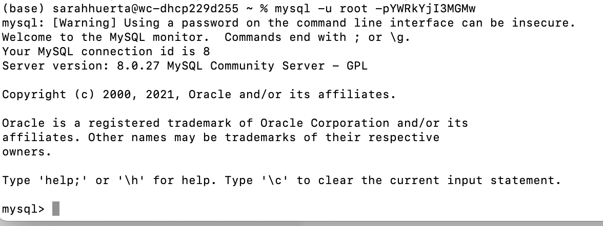
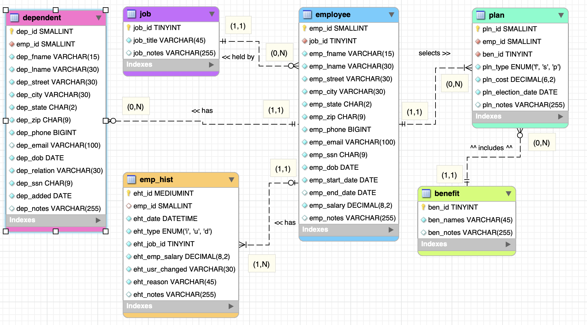
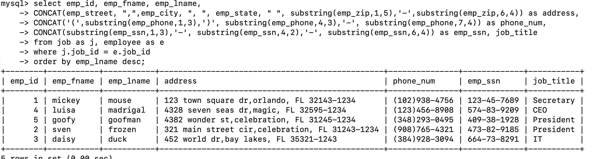
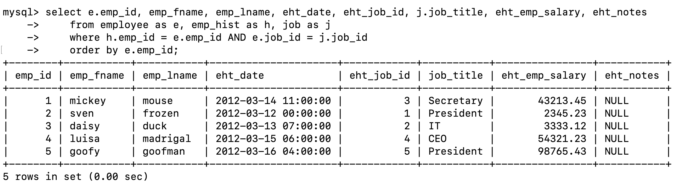
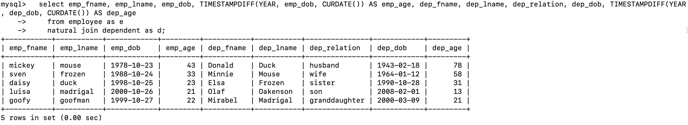
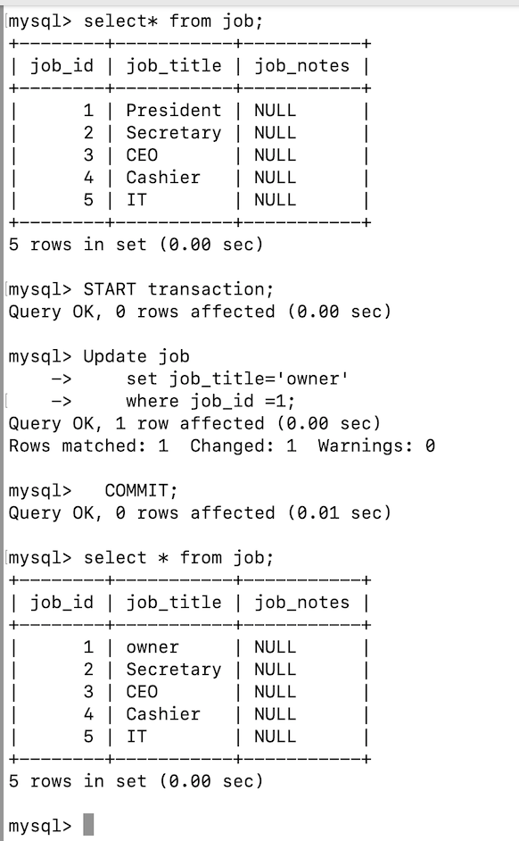
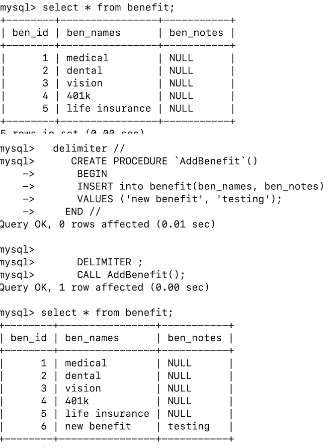
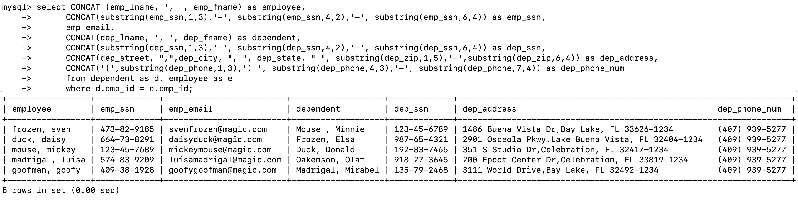
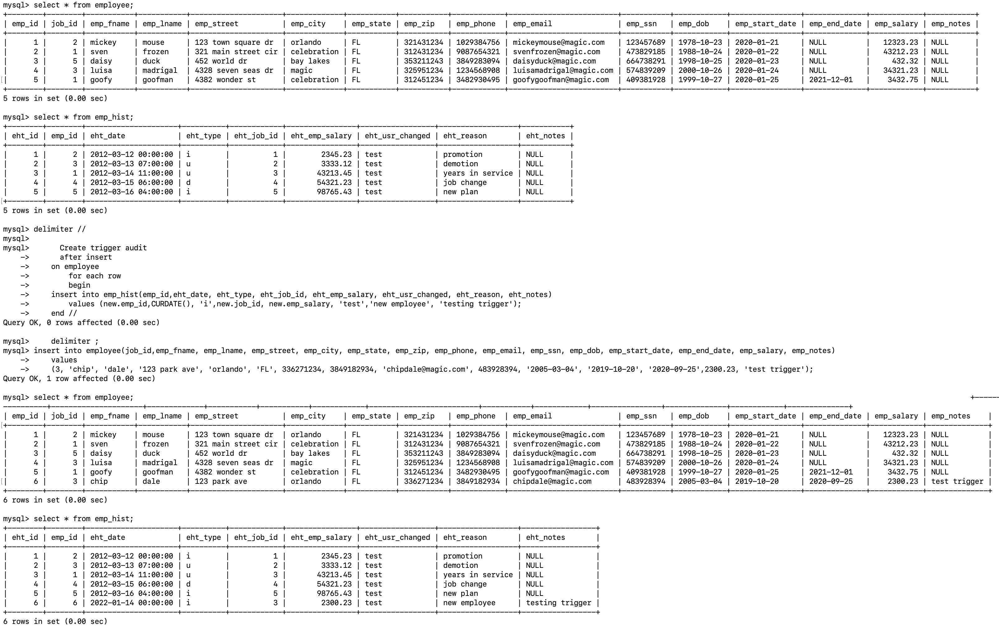

> **NOTE:** This README.md file should be placed at the **root of each of your repos directories.**
>
>Also, this file **must** use Markdown syntax, and provide project documentation as per below--otherwise, points **will** be deducted.
>

# LIS3781 - Advanced Database Managment

## Sarah Huerta

### Assignment 1 Requirements:

*Four Parts*

1. Distributed Version Control with Git and Bitbucket
2. Development Installations
3. Bitbucket repo links:
    * SQL Query Statements and ERD Database
    * the completed tutorial (bitbucketstationlocations).

 #### Git commands w/short descriptions:

    1. git init - Create an empty Git repository or reinitialize an
           existing one
    2. git status - Show the working tree status
    3. git add - Add file contents to the index
    4. git commit - Record changes to the repository
    5. git push - Update remote refs along with associated objects
    6. git pull - Fetch from and integrate with another repository or a
           local branch
    7. git merge - Join two or more development histories together

### Assignment Screenshots:

*Screenshot of mysql running*:

*ERD Images*:

### SQL QUERY Examples with Output

### Query 1

### Query 2

### Query 3

|  Query 4 |  Query 5 |
| ---------- | ---------- |
|  |  |

### Query 6

### Query 7

#### Tutorial Links:

*Bitbucket Tutorial - Station Locations:*
[A1 Bitbucket Station Locations Tutorial Link](https://bitbucket.org/sah16m/bitbucketstationlocations/ "Bitbucket Station Locations")
