# LIS3781 Advanced Database Management

## Sarah Huerta

### Assignment 2 Requirements:
    * Creating tables, database, and insert statements using MySQL Server.
    * Granting Privileges to different users on server.
    * Populating data and pushing to both local and cloud server.

### MySQL Query Screenshots

#### Table Inserts
| Table 1 : Commany | Table 2: Customer |
|-----|-----|
| 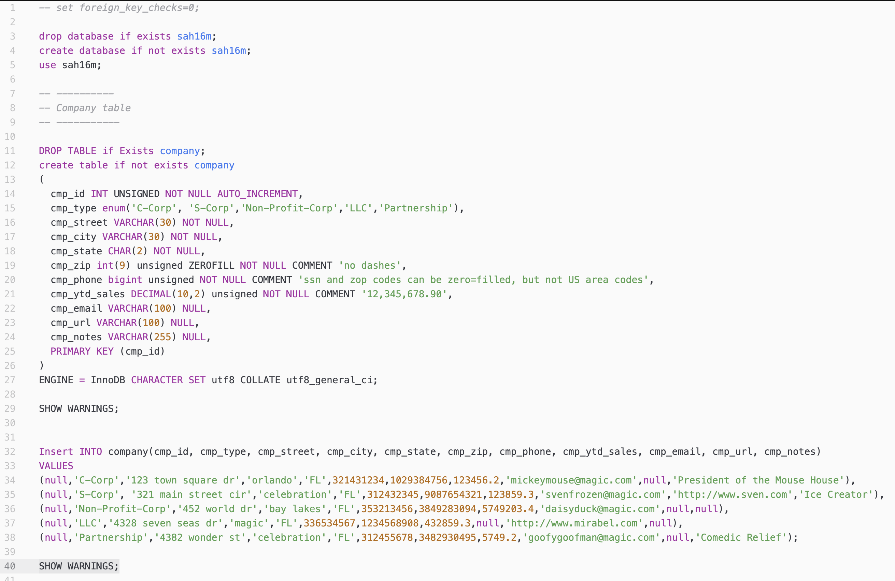 | 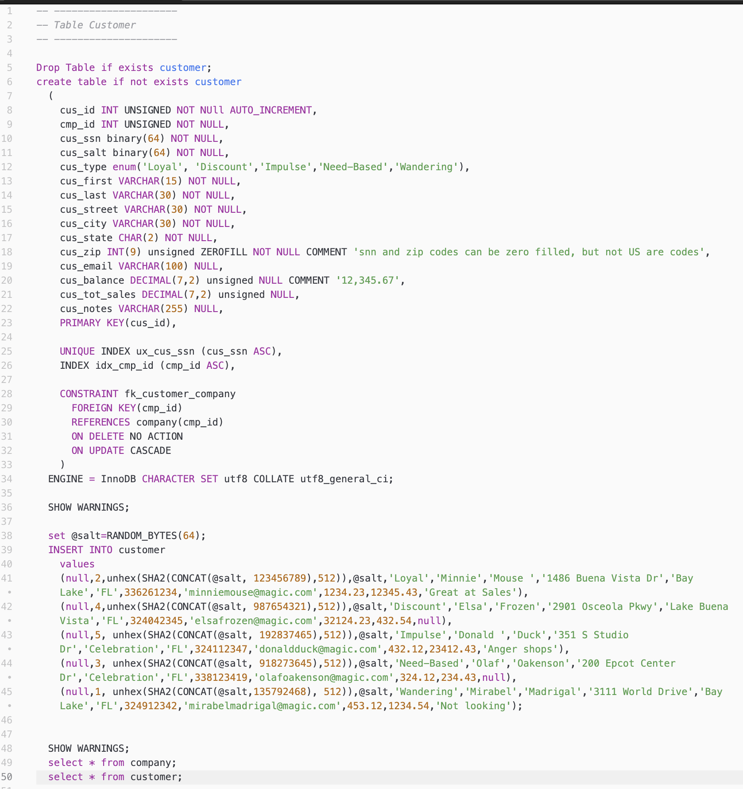 |

| Table With Data |
| ----- |
| 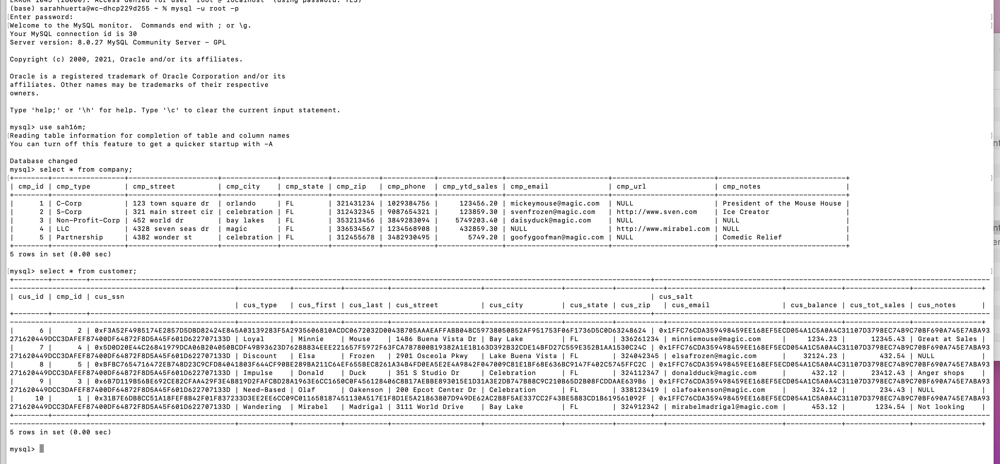 |

#### Granting Privileges for users

| User 1 Privileges | User 2 Privileges |
| ------- | ------- |
| 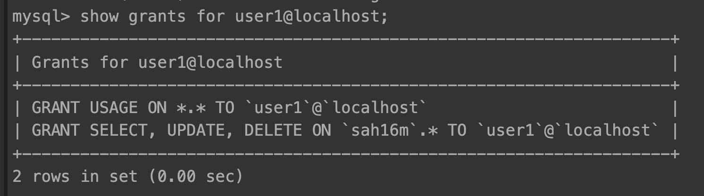 | 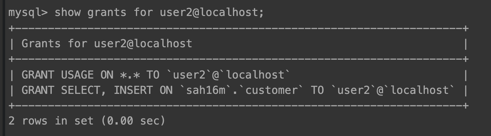 |

| User 2 and MySQL version |
| ------- |
| 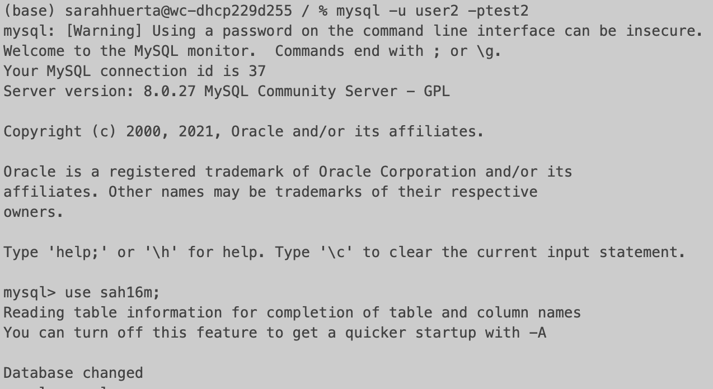 |

| Local Privileges | Local Tables |
| ---- | ---- |
|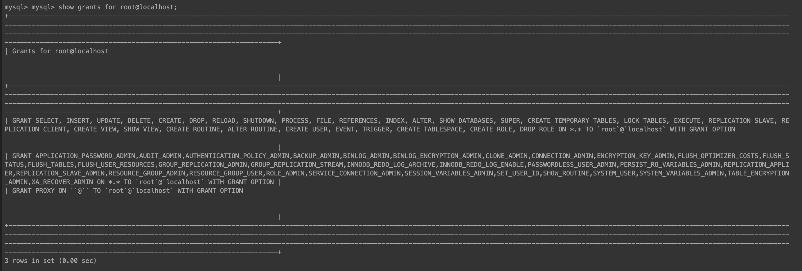 | 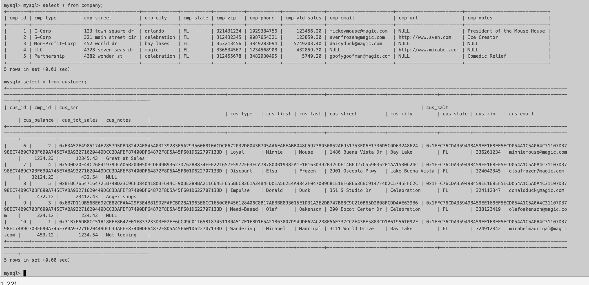 |

#### Logged in as User 1
| Insert Errors for Company | Insert Errors for Customer |
| ---- | ---- |
| 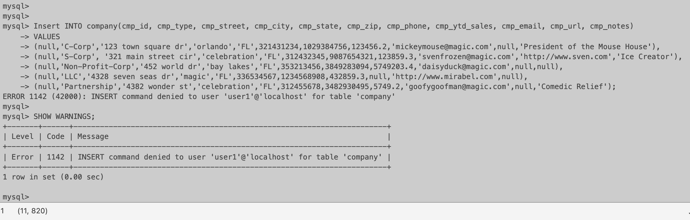 | 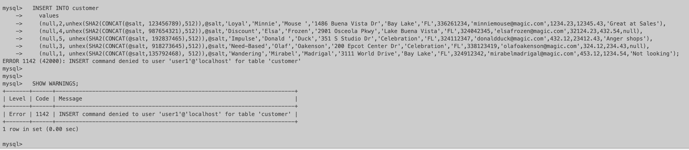 |

#### Logged in as User 2
| Select Errors for Company | Delete Errors for Customer |
| ---- | ---- |
| 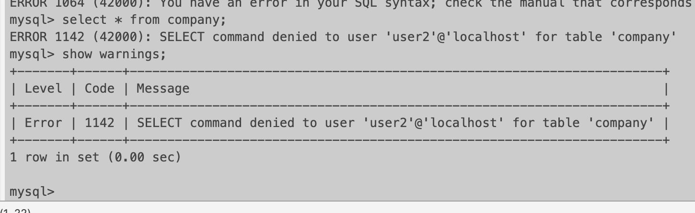 | 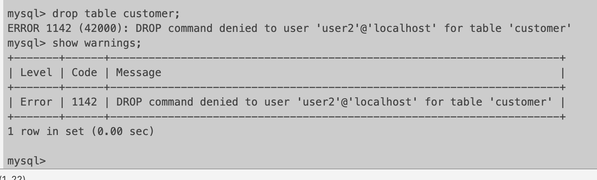 |

#### Logged in as Local Admin

| Drop Commands |
| ----- |
| 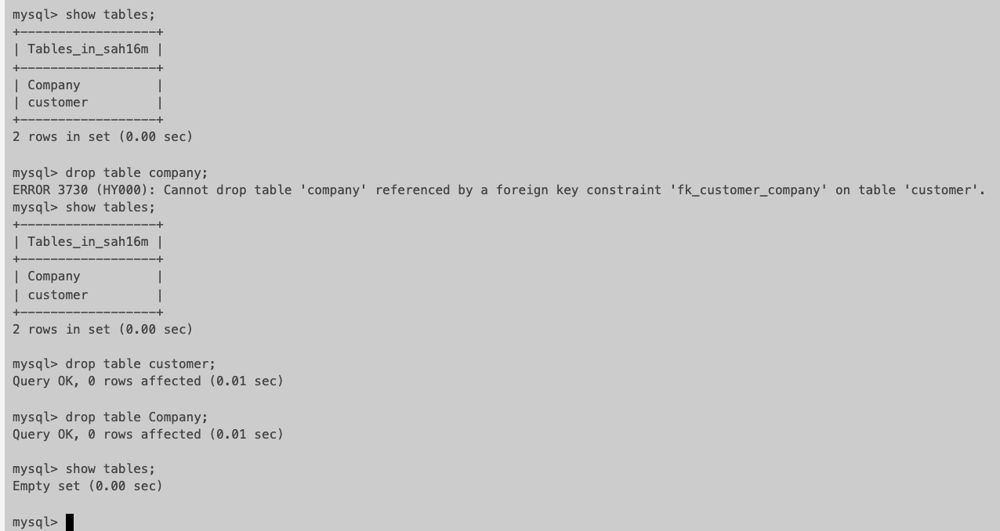
