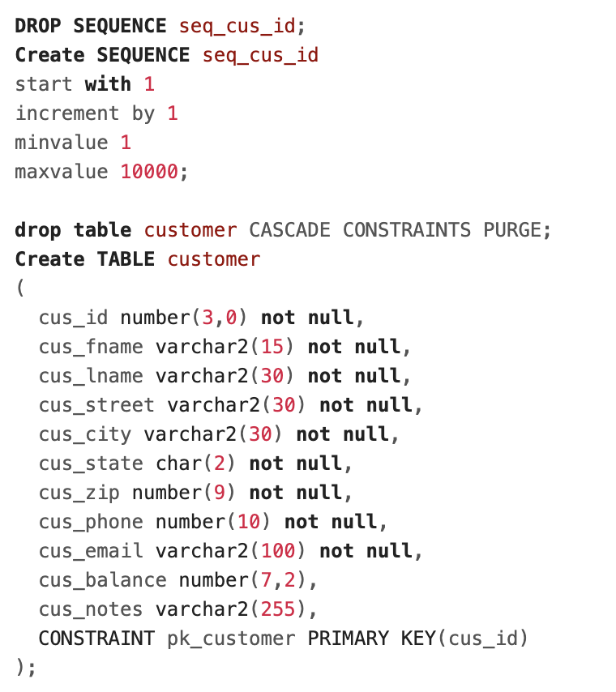
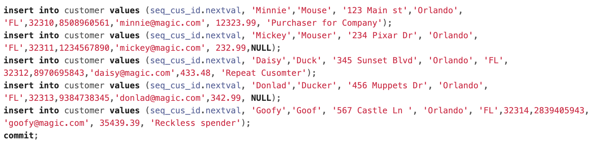
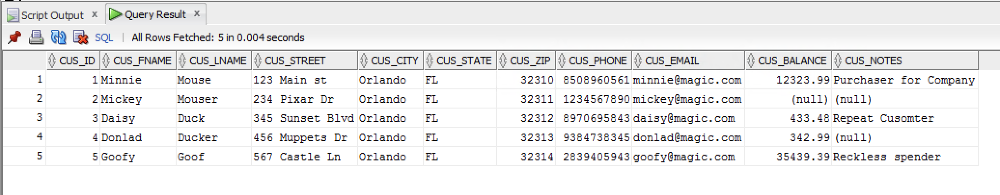
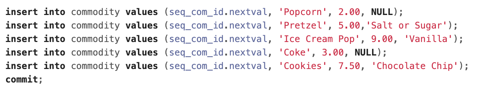
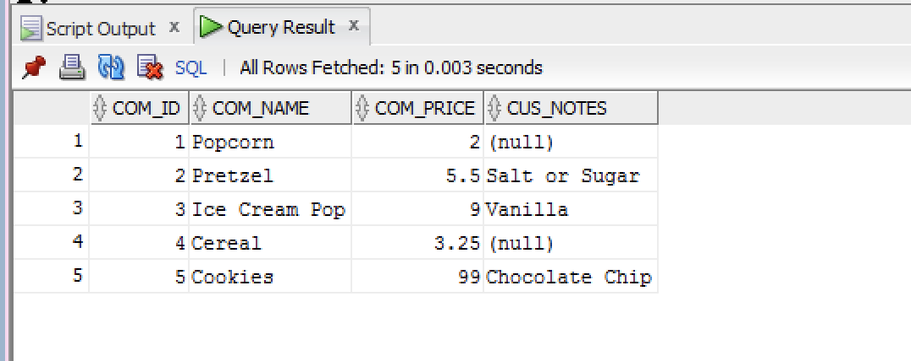
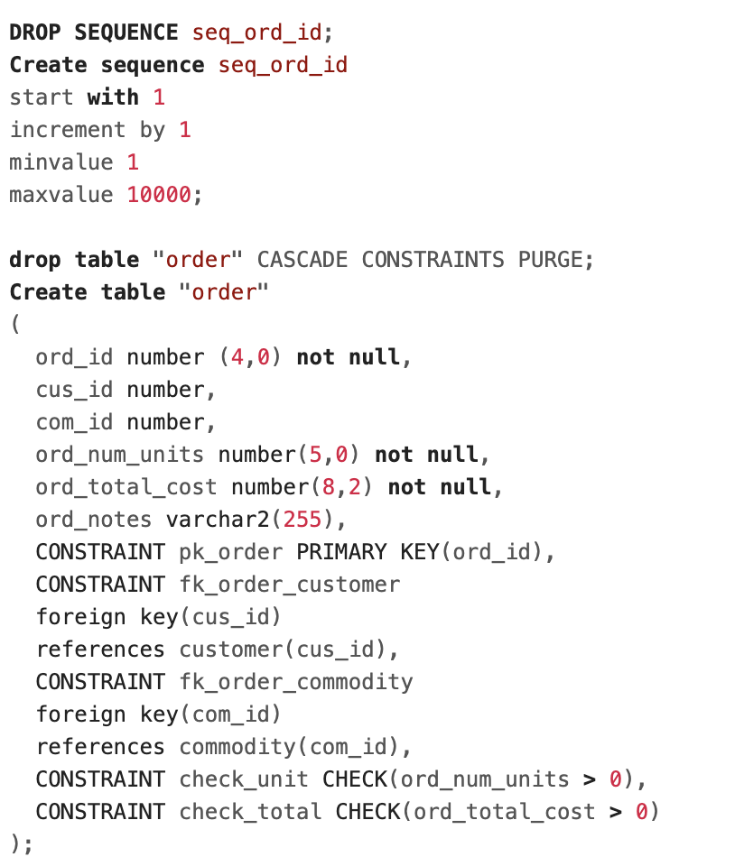
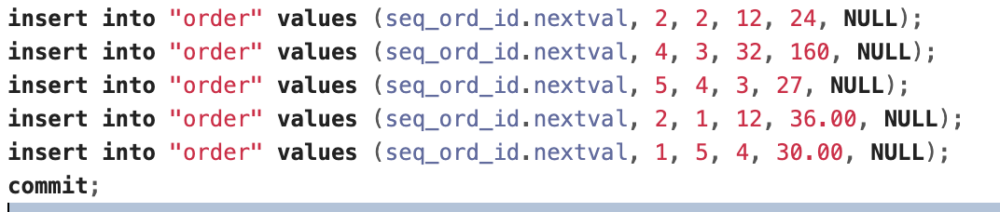
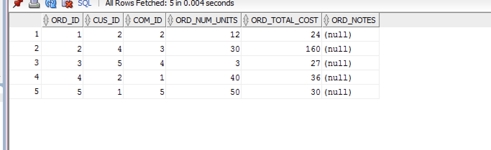

# LIS3781 Advanced Database Management

## Sarah Huerta

### Assignment 3 Requirements:
1. Download, Install, and operate Microsoft Remote Desktop to run Oracle Server
2. Create Customer, Commodity, and Order tables
3. Create and Excute Queries to retrieve specified information

#### Customer Table
| Customer Creation | Customer Inserts |
| --- | --- |
| | |

| Customer Output |
| --- |
| |

#### Commodity Table
| Commodity Creation | Commodity Inserts |
| --- | --- |
| | |

| Commodity Output |
| --- |
| |

#### Order Table
| Order Creation | Order Inserts |
| --- | --- |
| | |

| Order Output |
| --- |
| |

#### Example Query Solutions
~~~
 --1. Display Oracle version (one method).
SELECT * FROM v$version;
--2. Display Oracle version (another method).
SELECT * FROM v$version
WHERE banner LIKE 'Oracle%';
--3. Display current user.
select user from dual;
--4. Display current day/time (formatted, and displaying AM/PM).
SELECT TO_CHAR(SYSDATE,'dd-mon-yyyy hh:mi:ss PM') As "DATE"
FROM dual;
--5. Display your privileges.

select * from USER_ROLE_PRIVS where USERNAME=USER;
select * from USER_TAB_PRIVS where Grantee = USER;
select * from USER_SYS_PRIVS where USERNAME = USER;
--6. Display all user tables.
SELECT owner, table_name FROM all_tables
where owner = USER;
--7. Display structure for each table.
Describe "order";
Describe commodity;
Describe customer;
--8. List the customer number, last name, first name, and e-mail of every customer.
Select cus_id AS "ID",
cus_lname AS "Last Name",
cus_fname AS "First Name",
cus_email AS "Email"
from customer;
--9. Same query as above,include street,city,state,and sort by state in descending order,and last name in ascending order.
Select cus_id AS "ID",
cus_lname AS "Last Name",
cus_fname AS "First Name",
cus_email AS "Email",
cus_street AS "Street",
cus_city AS "City",
cus_state AS "State"
from customer
ORDER by cus_state DESC, cus_lname ASC;

--10. What is the full name of customer number 3? Display last name first.
select cus_lname AS "Last Name",
cus_fname AS "First Name"
from customer
where cus_id = 3;
--11.Find the customer number, last name, first name, and current balance for every customer whose
--balance exceeds $1,000, sorted by largest to smallest balances.
Select cus_id AS "ID",
cus_lname AS "Last Name",
cus_fname AS "First Name",
cus_balance AS "Balance"
from customer
where cus_balance > 1000
order by cus_balance DESC;

--12.List the name of every commodity, and its price (formatted to two decimal places, displaying $
--sign), sorted by smallest to largest price.
select com_name as "Commodity Name", CONCAT( '$',round(com_price,2)) AS "Price"
FROM commodity
order by com_price ASC;

--13. Display all customers’ first and last names, streets, cities, states, and zip codes as follows (ordered by zip code descending).
select concat(concat(cus_lname, ',' ), cus_fname) as "Name",
concat(concat(concat(concat(cus_street, ', '), concat(cus_city, ', ')), concat(cus_state,  ' ')), cus_zip) as "Address"
from customer
order by cus_zip DESC;

--14. List all orders not including cereal--use subquery to find commodity id for cereal.
 select * from "order";
 select * from "order"
 where com_id != (select com_id from commodity where com_name='Cereal');

--15.List the customer number, last name, first name, and balance for every customer whose balance is between $500 and $1,000, (format
--currency to two decimal places, displaying $ sign).
Select cus_id as "ID",
concat(concat(cus_lname, ' ,'), cus_fname) as "Name",
concat('$',round(cus_balance,2)) as "Balance"
from customer
where cus_balance > 500 AND cus_balance < 1000;
--16.List the customer number, last name, first name, and balance for every customer whose balance is greater than the average balance,
--(format currency to two decimal places, displaying $ sign

Select cus_id as "ID",
concat(concat(cus_lname, ' ,'), cus_fname) as "Name",
concat('$',round(cus_balance,2)) as "Balance"
from customer
where cus_balance > (select AVG(cus_balance) from customer);

--17.List the customer number, name, and *total* order amount for each customer sorted in descending *total* order amount, (format
--currency to two decimal places, displaying $ sign), and include an alias “total orders” for the derived attribute.
select * from "order";
select * from customer;

select c.cus_id AS "ID",
concat(concat(c.cus_lname, ', '), c.cus_fname) AS "Name", concat('$', round(o.ord_total_cost,2)) as "Total Orders"
from customer c, "order" o
where c.cus_id = o.cus_id;

--18.List the customer number, last name, first name, and complete address of every customer who lives on a street with "Peach"
--anywhere in the street name.

select cus_id,
concat(concat(cus_lname, ',' ), cus_fname) as "Name",
concat(concat(concat(concat(cus_street, ', '), concat(cus_city, ', ')), concat(cus_state,  ' ')), cus_zip) as "Address"
from customer
where cus_street Like '%Peach%';

--19.List the customer number, name, and *total* order amount for each customer whose *total* order amount is greater than $1500, for
--each customer sorted in descending *total* order amount, (format currency to two decimal places, displaying $ sign), and include an
--alias “total orders” for the derived attribute.
select c.cus_id AS "ID",
concat(concat(c.cus_lname, ', '), c.cus_fname) AS "Name", concat('$', round(o.ord_total_cost,2)) as "Total Orders"
from customer c
inner join "order" o on  c.cus_id = o.cus_id
where o.ord_total_cost > 100
Order by o.ord_total_cost DESC;
--20.List the customer number, name, and number of units ordered for orders with 30, 40, or 50 units ordered.
select c.cus_id AS "ID",
concat(concat(c.cus_lname, ', '), c.cus_fname) AS "Name",
o.ord_num_units AS "Number of Units Ordered"
from customer c
inner join "order" o on  c.cus_id = o.cus_id
where o.ord_num_units = 30 OR o.ord_num_units = 40 OR o.ord_num_units = 50;

--21.Using EXISTS operator: List customer number, name, number of orders, minimum, maximum, and sum of their order total cost, only if
--there are 5 or more customers in the customer table, (format currency to two decimal places, displaying $ sign).
select c.cus_id AS "ID",
max(o.ord_num_units) as "Max",
concat(concat(c.cus_lname, ', '), c.cus_fname) AS "Name",
o.ord_num_units AS "Number of Orders",
concat('$', round(o.ord_total_cost,2)) as "Total Orders"
from customer c
inner join "order" o on  c.cus_id = o.cus_id
where c.cus_id <= 5
group by c.cus_id;
-- 22. Find aggregate values for customers:
--(Note, difference between count(*) and count(cus_balance), one customer does not have a balance.)
select sum(cus_balance) AS "Aggregate Values for customer"
from customer;
--23. Find the number of unique customers who have orders.
SELECT COUNT ( DISTINCT cus_id ) AS "Unique Customers"
FROM customer;
--24.List the customer number, name, commodity name, order number, and order amount for each customer order, sorted in descending
--order amount, (format currency to two decimal places, displaying $ sign), and include an alias “order amount” for the derived
--attribute.
--25. Modify prices for DVD players to $99.

Update commodity
set com_price = 99.00
where com_name = 'Cookies';
~~~
