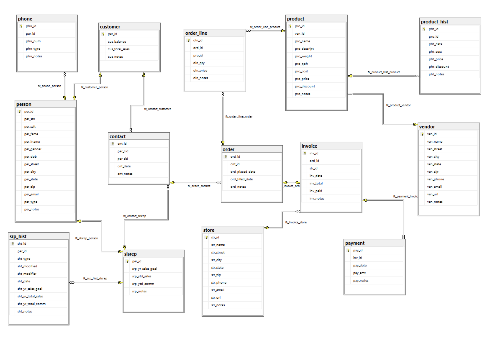

# LIS3781 Advanced Database Management

## Sarah Huerta

### Assignment 4 Requirements:
1. Use of MS SQL Server to create high volume Database
2. Use of Salt and Hash with SHA 512 method.
3. Deliverable of Entity Relational Diagram

| ERD for Home Office Supply Company |
| -- |
|  |
