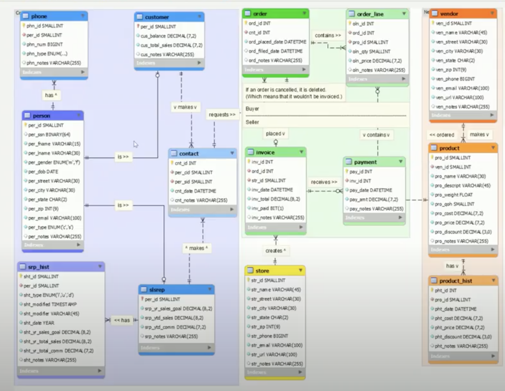
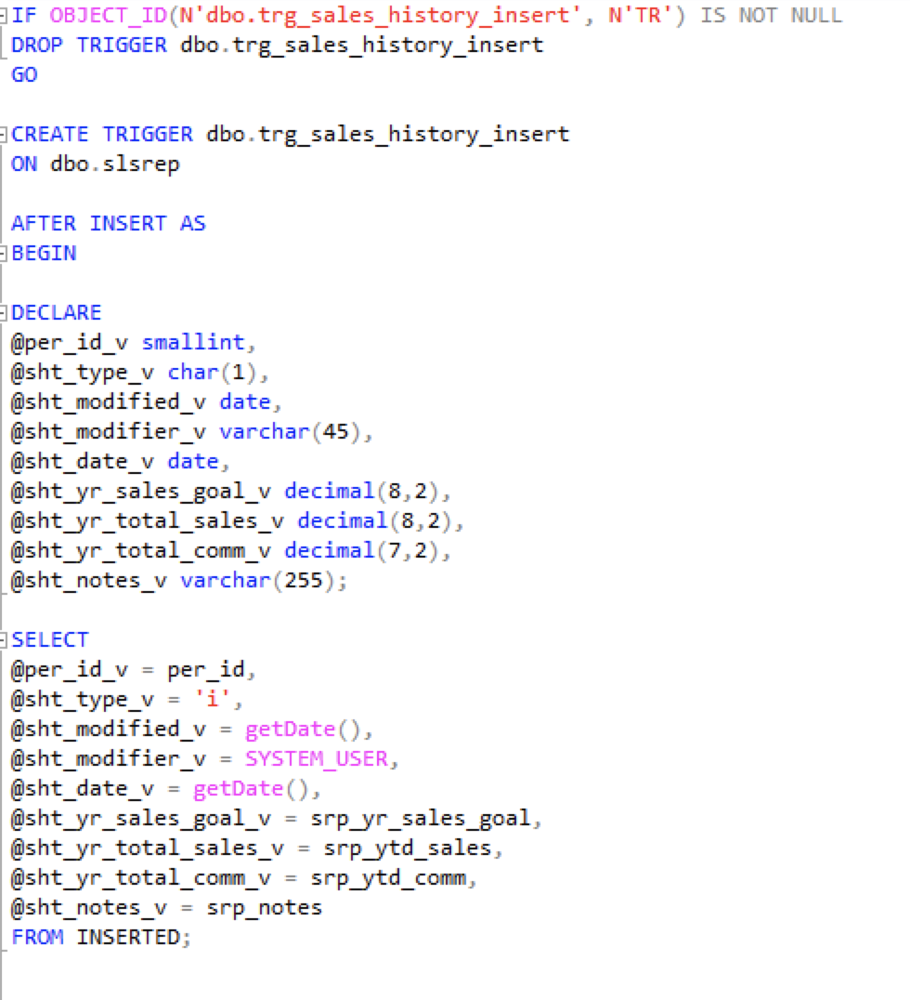
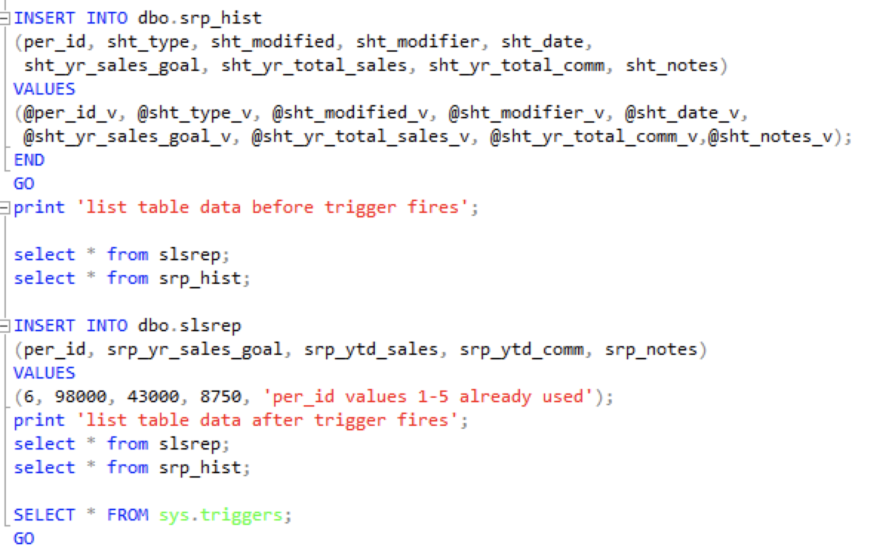
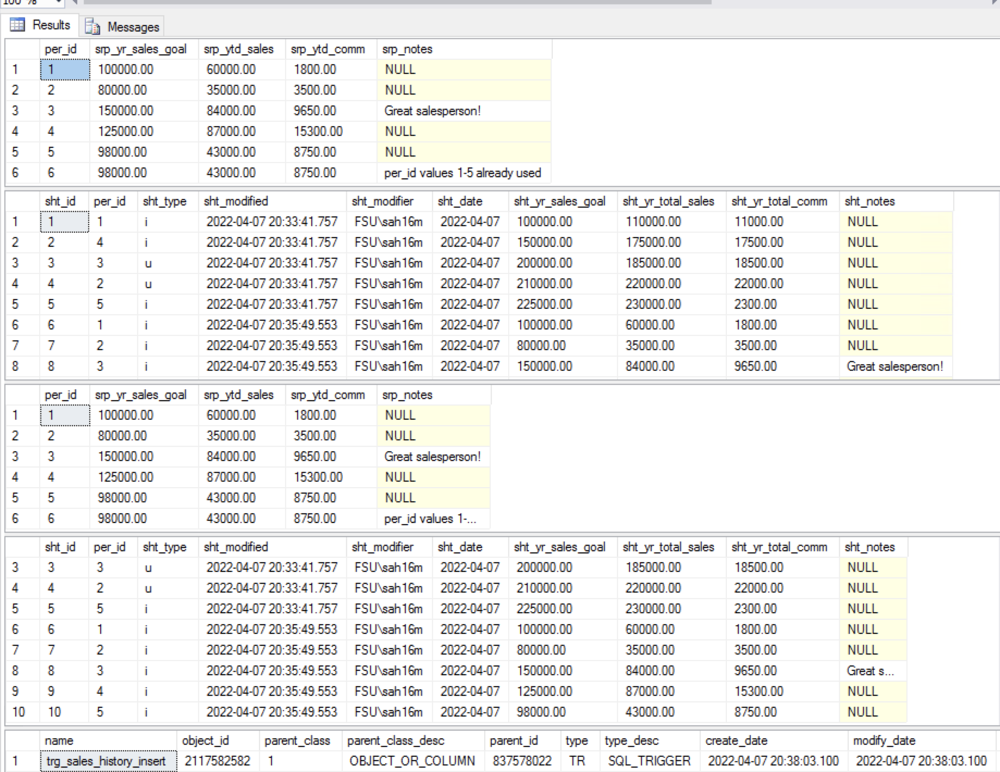

# LIS3781 Advanced Database Management

## Sarah Huerta

### Assignment 5 Requirements:
1. Use of MS SQL Server to create high volume Database with additional table
2. Use of Salt and Hash with SHA 512 method.
3. Deliverable of Entity Relational Diagram

#### Entity Relational Diagram
| Home Office Supply Company |
| -- |
|  |

#### Stored Procedure Examples

| Trigger Sales History Insert Part 1 |  Trigger Sales History Insert Part 2 |
| --- | -- |
| |  |

|Sample Report Output |
| -- |
|  |
