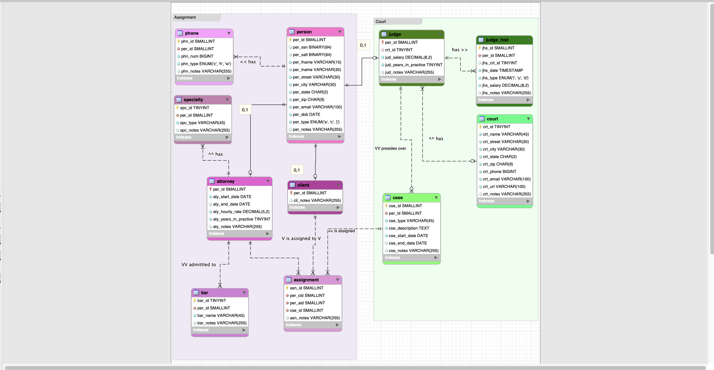
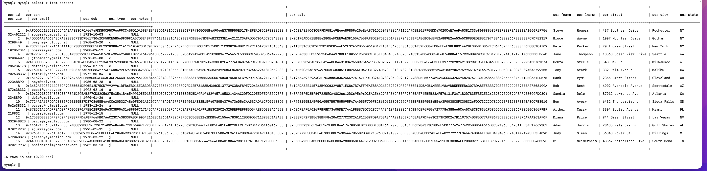

# LIS3781 Advanced Database Management

## Sarah Huerta

### Project 1 Requirements:
    1. Use of MySQL server to create local city court case database.
    2. Using SHA2 in order to protect sensetive information i.e. SSN's
    3. Creation of stored procedures to salt and hash information.

#### Asssignment Examples

| Entity Relational Diagram |
| ---- |
|  |

| Person Data Table |
| ------|
| 

#### Links to a3.mwb and p1_solution files

[p1.sql file](https://bitbucket.org/sah16m/lis3781/src/master/p1/lis3781_huerta_p1_solutions.sql)

[p1.mwb file](https://bitbucket.org/sah16m/lis3781/src/master/p1/huerta_p1.mwb)
