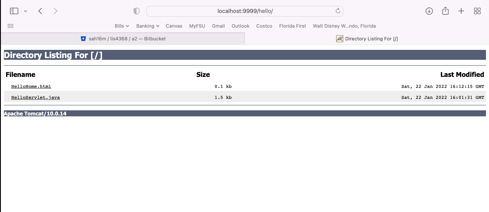
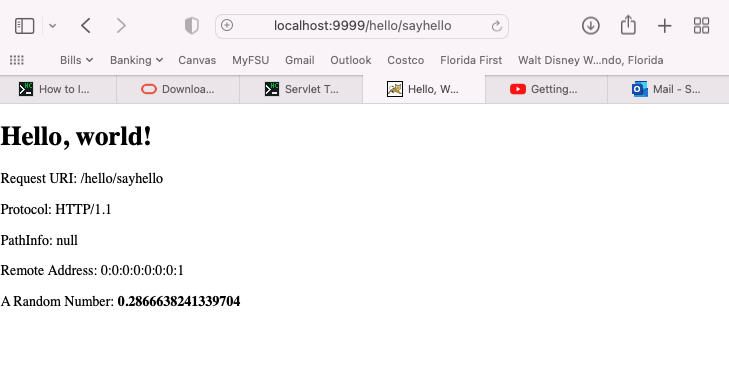
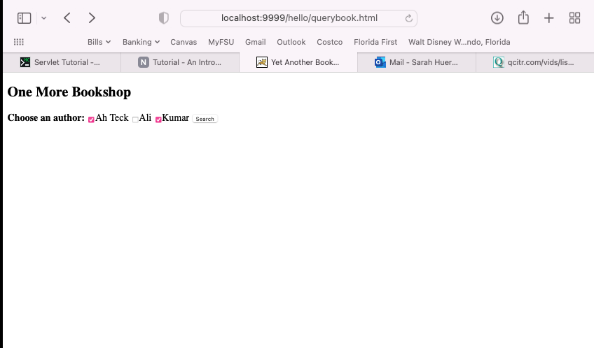
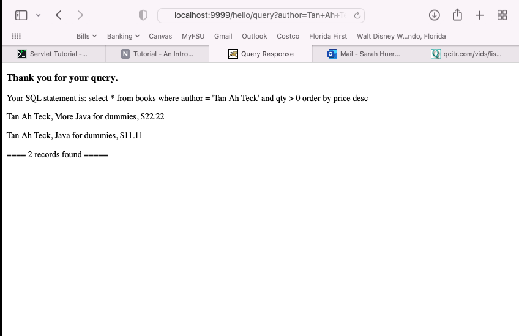
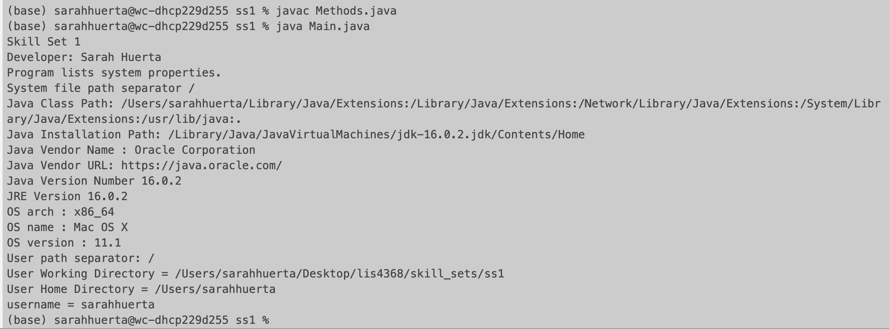
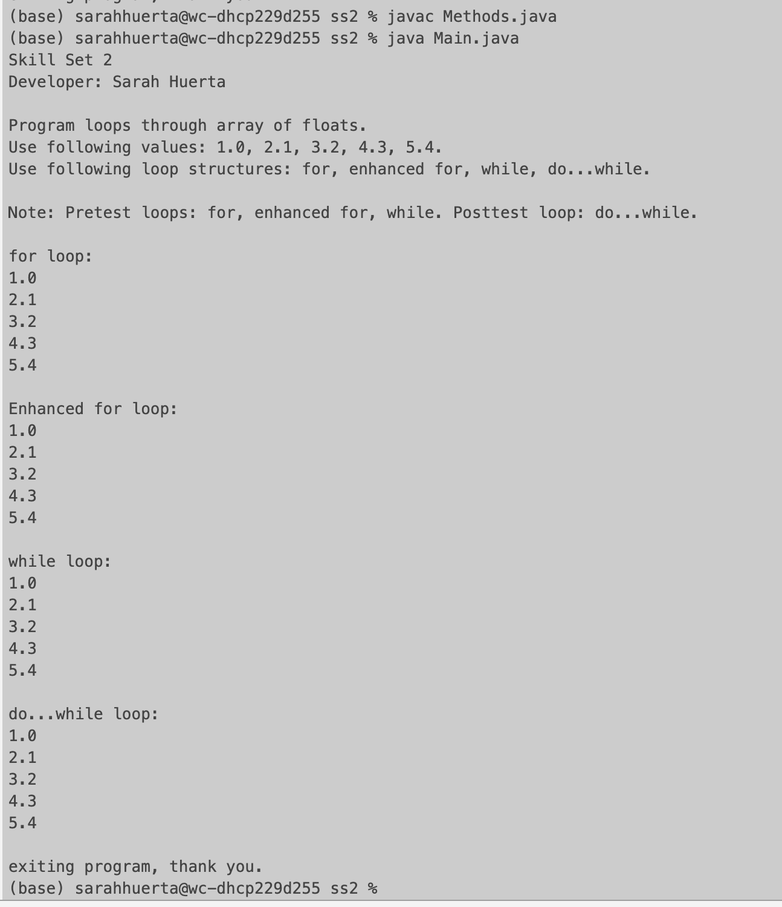
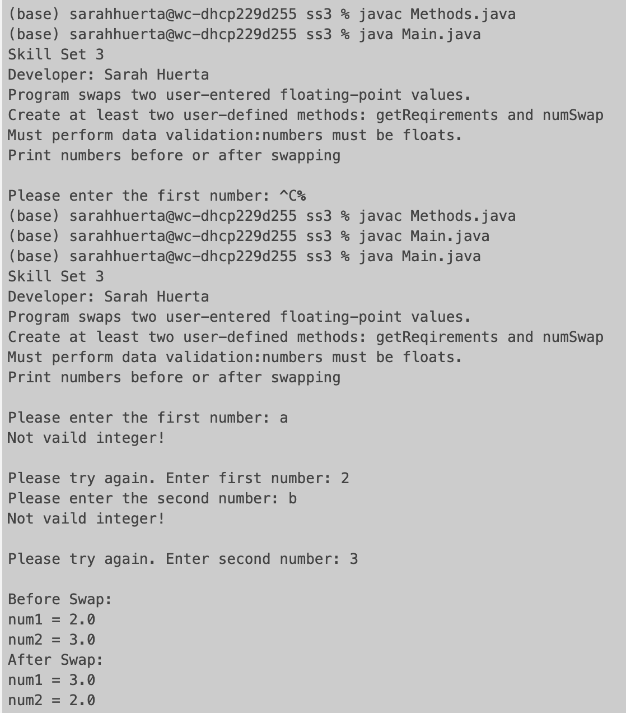

# LIS4368 Advanced Web Applications Development

## Sarah Huerta

### Assignment 2 Requirements:
     * Creation of Database Servlet Webpage
     * Implemtation of C.R.U.D in webpage design
     * Associated Screenshots for Assignment

#### Local Host Webpage Links
[LIS4368 Webpage ](http://localhost:9999/lis4368/index.jsp "LIS4368 Webpage")

#### Assignment Screenshots
| Hello Path |
| ------- |
|  |

| Say Hi |
| ------- |
|  |

| Query Book |
| ------- |
|  |

| Results |
| ------- |
|  |

#### Skill Sets

| Skill Set 1 |
| ------- |
|  |

| Skill Set 2 | Skill Set 3
| ------- | ------ |
|  |  |
