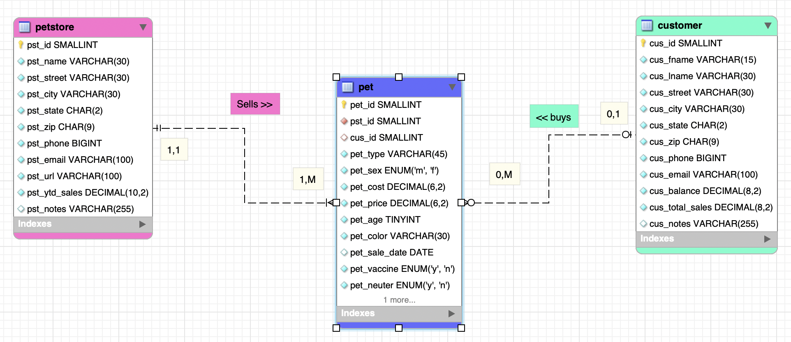
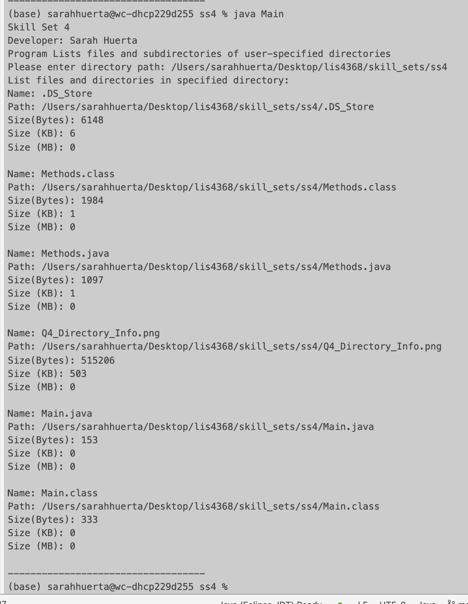
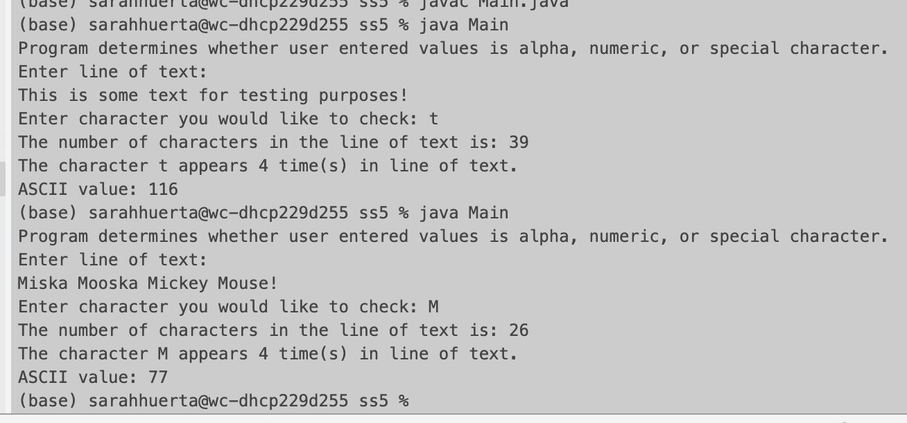
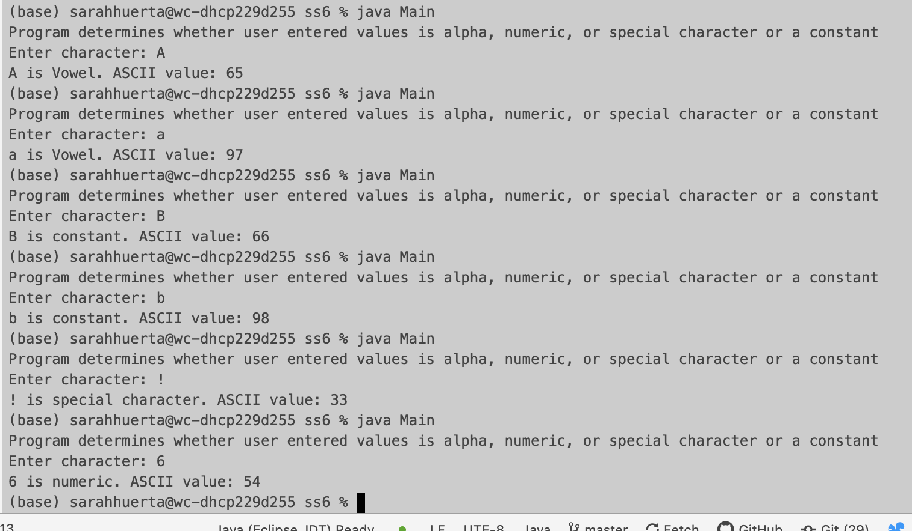

> **NOTE:** This README.md file should be placed at the **root of each of your repos directories.**
>
>Also, this file **must** use Markdown syntax, and provide project documentation as per below--otherwise, points **will** be deducted.
>

# LIS4368 - Advanced Web Application Development

## Sarah Huerta

#### Assignment 3 Requirements:

1. Screenshot of Pet Store ERD
2. Screen shots of 10 records from each Pet Store table
3. Links to a3.mwb and a3.sql

##### Screenshot of Pet Store ERD

#### Screenshot of 10 records from each Pet Store table

*Pet Table*

*Pet Store Table*

*Customer Table*

#### Links to a3.mwb and a3.sql files

[a3.sql file](https://bitbucket.org/sah16m/lis4368/src/master/a3/docs/a3.sql)

[a3.mwb file](https://bitbucket.org/sah16m/lis4368/src/master/a3/docs/a3.mwb)

#### Skill Sets

| Skill Set 4 |
| ------- |
|  |

| Skill Set 5 | Skill Set 6
| ------- | ------ |
|  |  |
