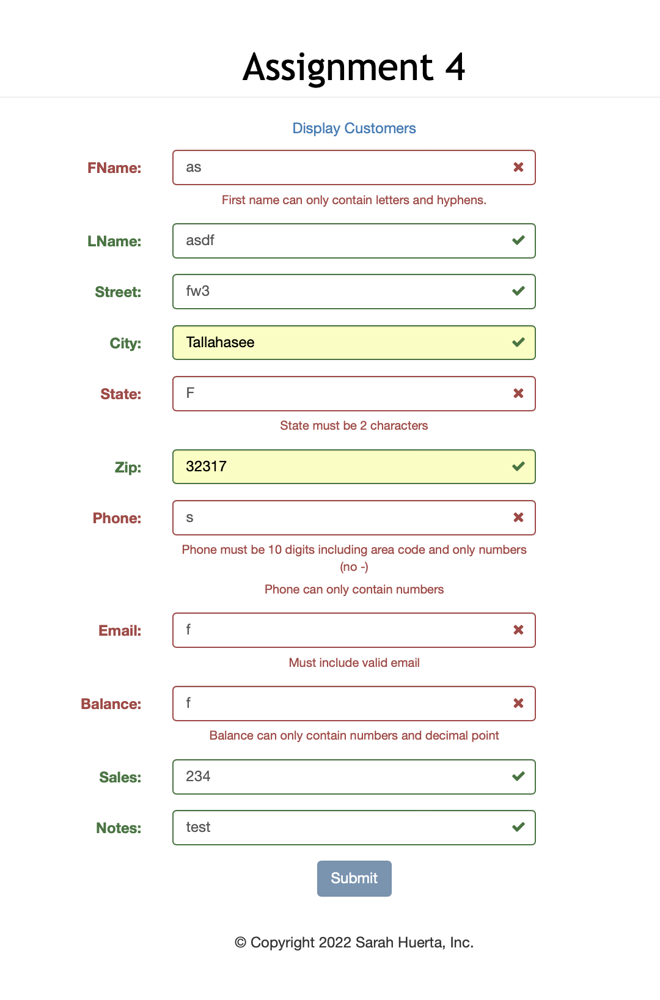
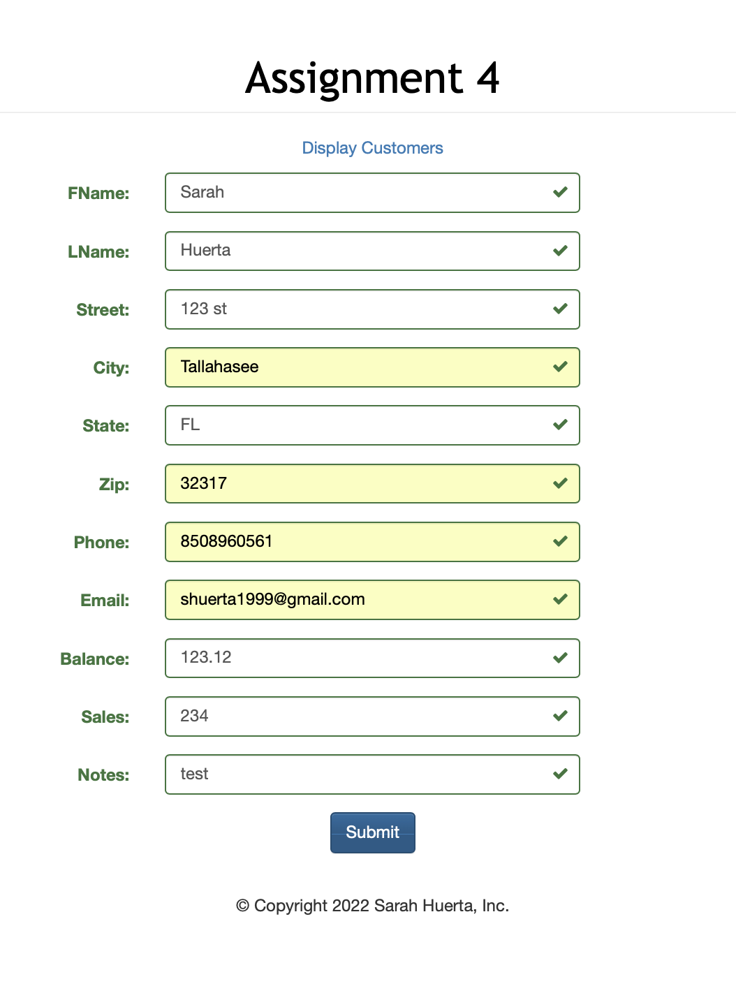
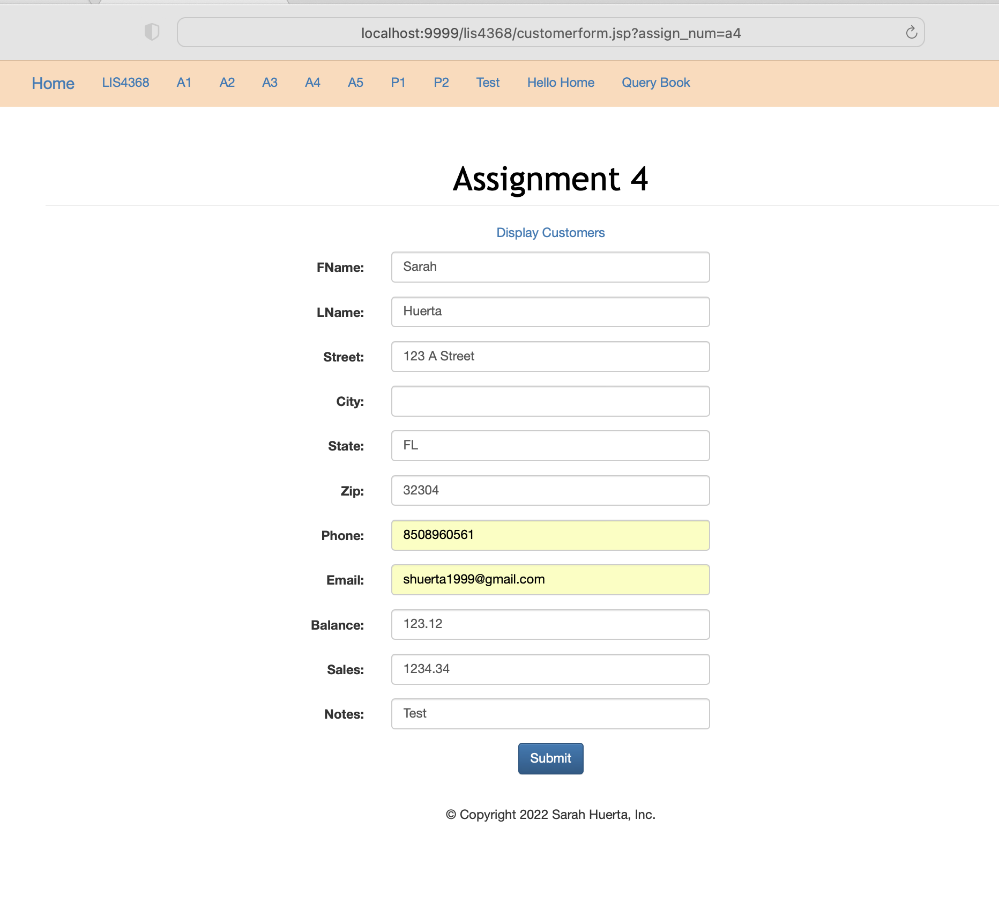
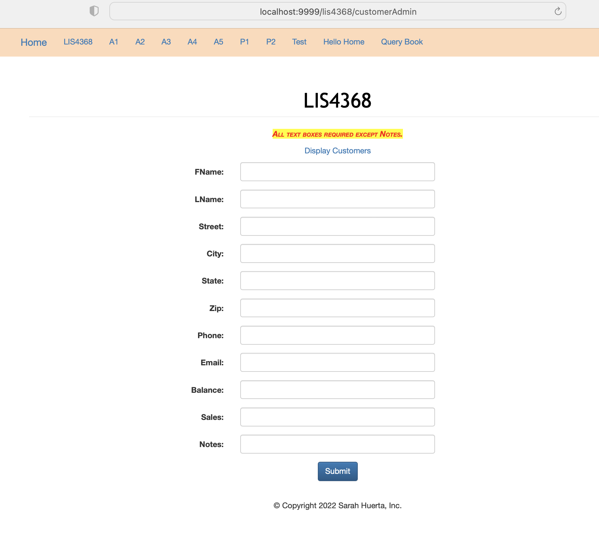
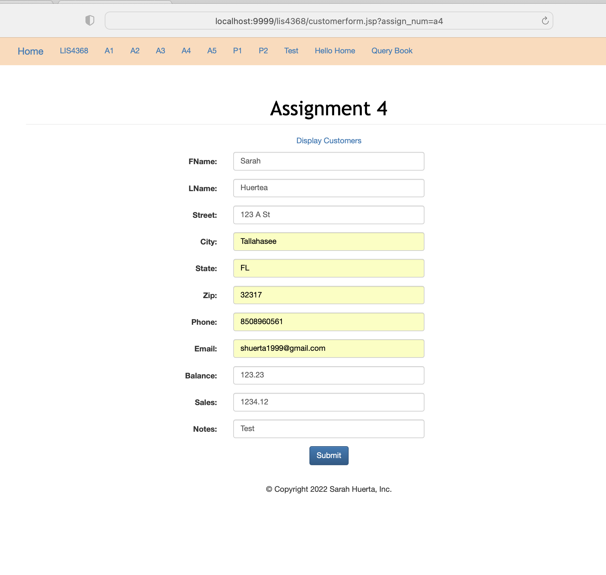
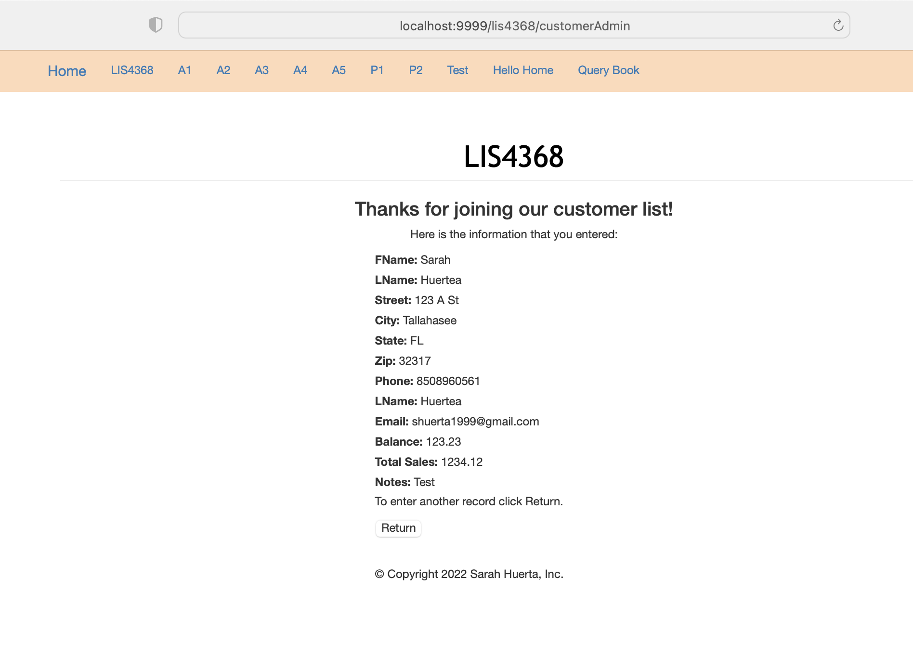
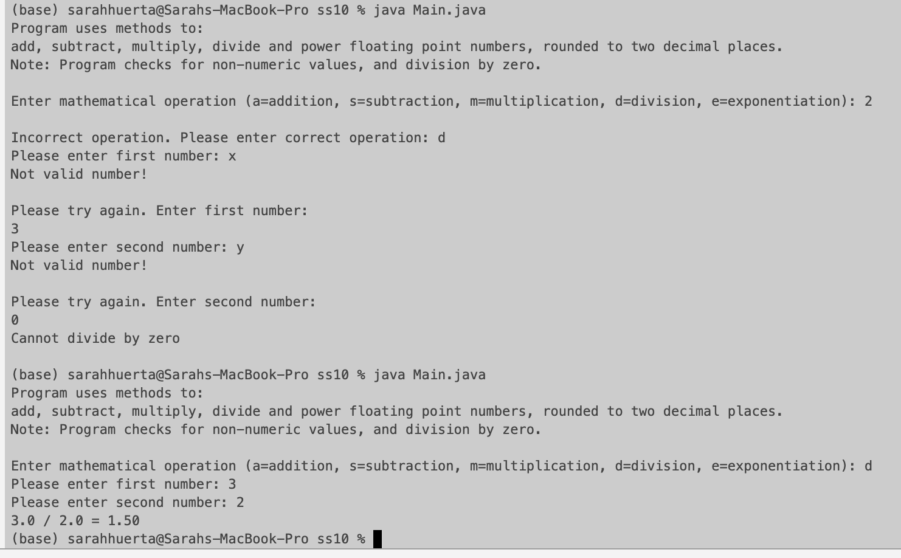
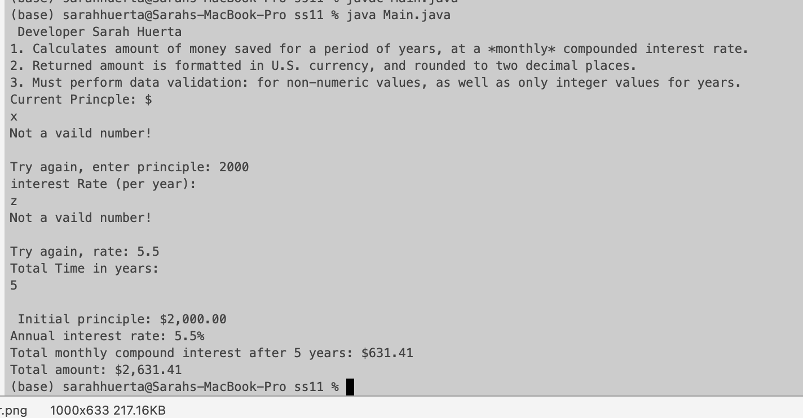
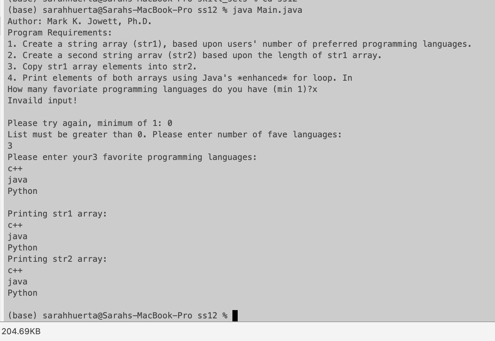

# LIS4368 - Advanced Web Application Development

## Sarah Huerta

#### Assignment 4 Requirements:

1. Use Model View Controller in application's implementation
2. Failure and Success of Server Side Validation
3. Skill sets 10-12

#### Failed User Entry

| Before | After |
| ------- | ------ |
|  |  |

| Before | After |
| ------- | ------ |
|  |  |

#### User Entry Complete

| Before | After |
| ------- | ------ |
|  |  |

#### Skill Sets

| Skill Set 10 |
| ------- |
|  |

| Skill Set 11 | Skill Set 12
| ------- | ------ |
|  |  |
