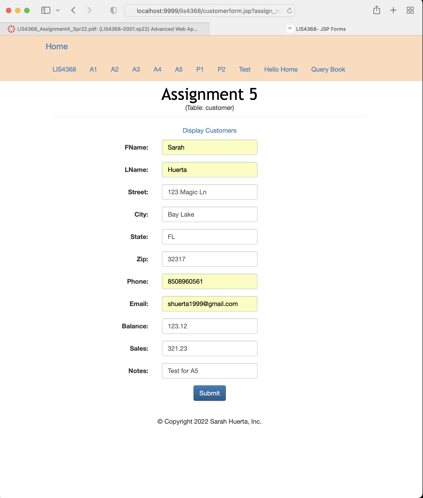
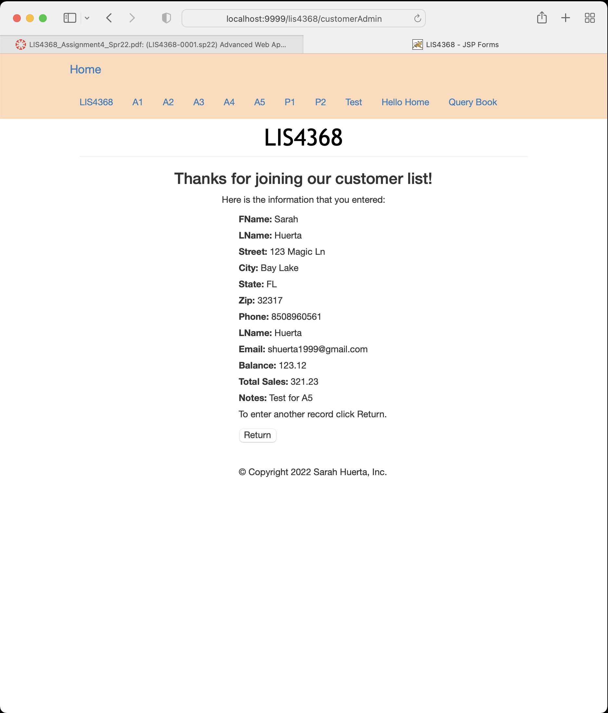
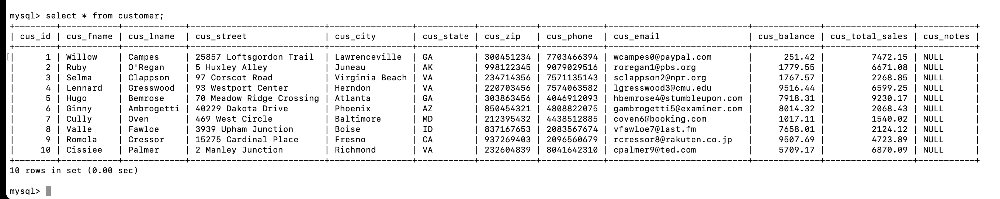
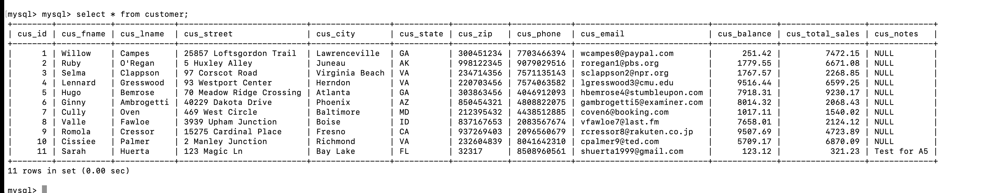
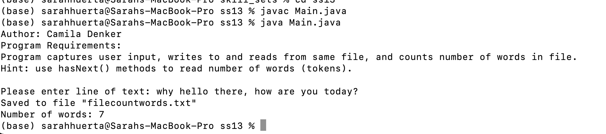
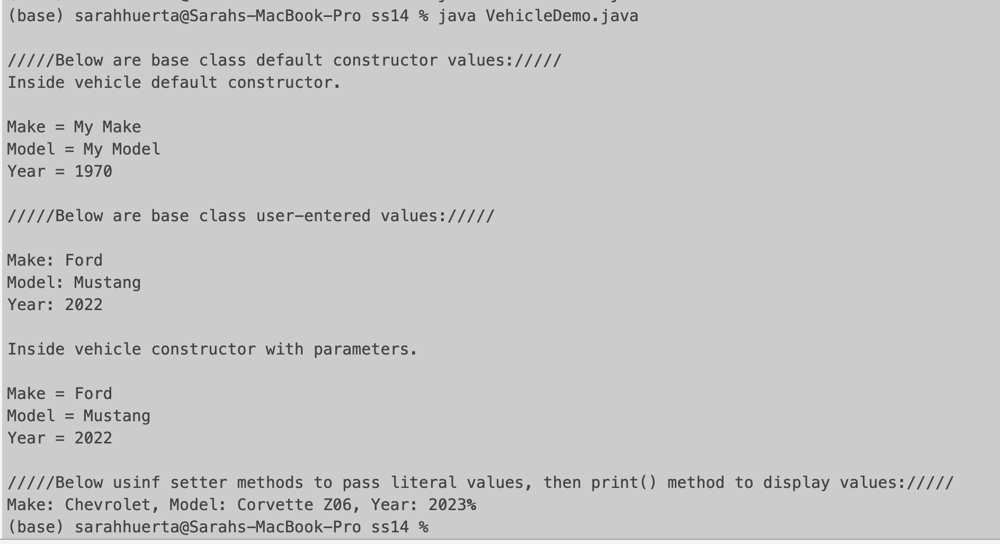
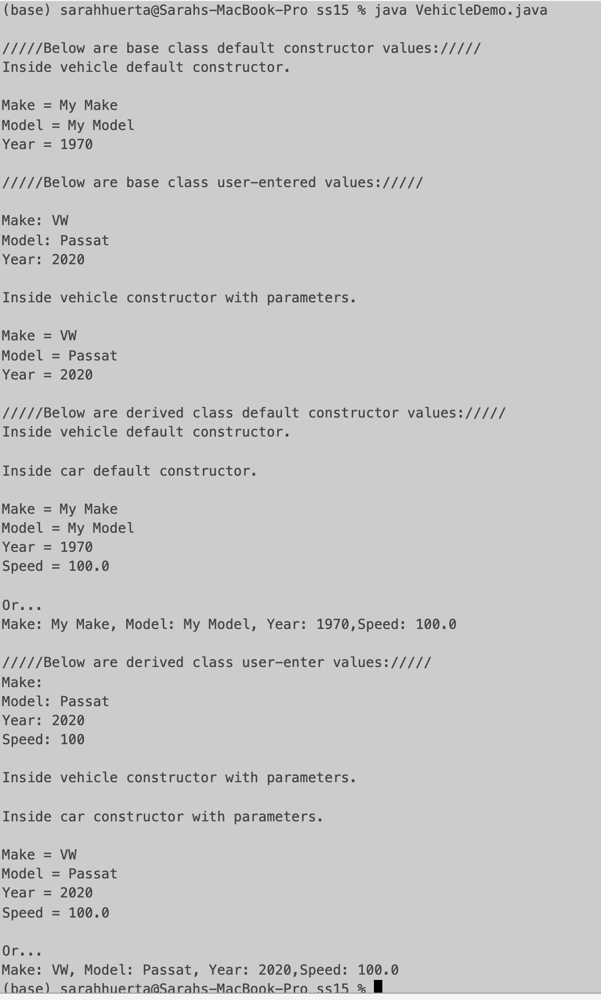

# LIS4368 - Advanced Web Application Development

## Sarah Huerta

#### Assignment 5 Requirements:

1. Use Model View Controller in application's implementation
2. Using Servlets, insertion using CRUD modeling
3. Skill sets 13-15

#### Data Entry with Server Side Validation

| Before | After |
| ------- | ------ |
|  |  |

#### Insertion into Customer Table

| Before | After |
| ------- | ------ |
|  |  |

#### Skill Sets

| Skill Set 13 |
| ------- |
|  |

| Skill Set 14 | Skill Set 15
| ------- | ------ |
|  |  |
