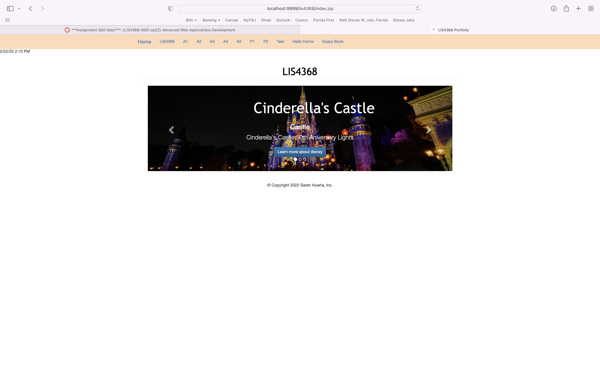
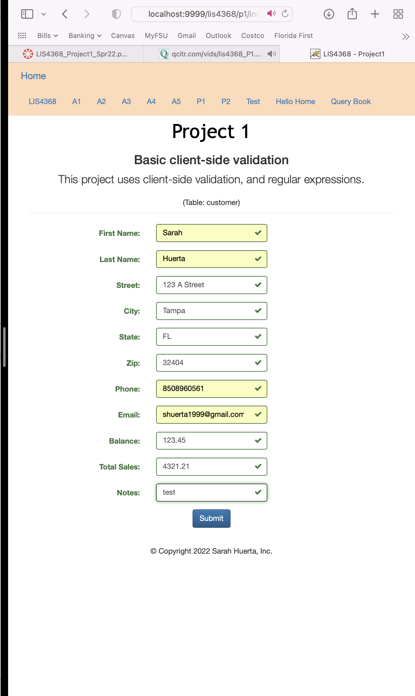
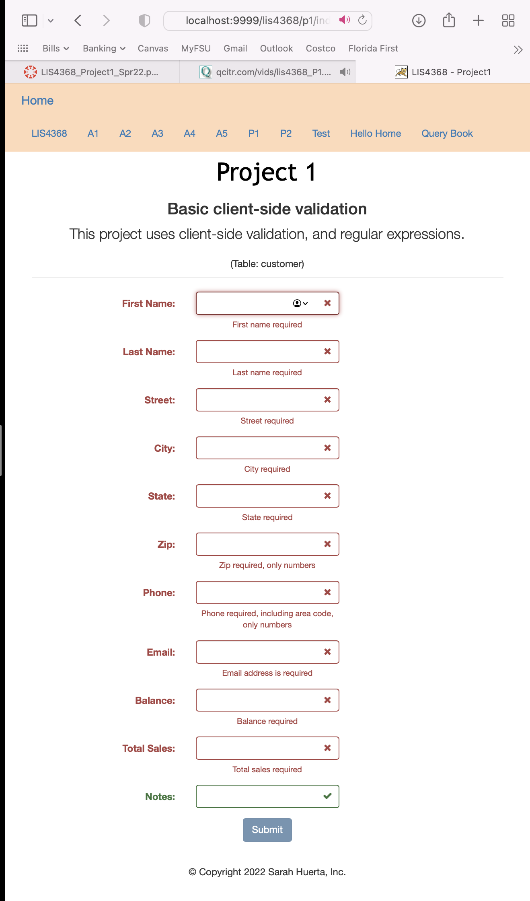
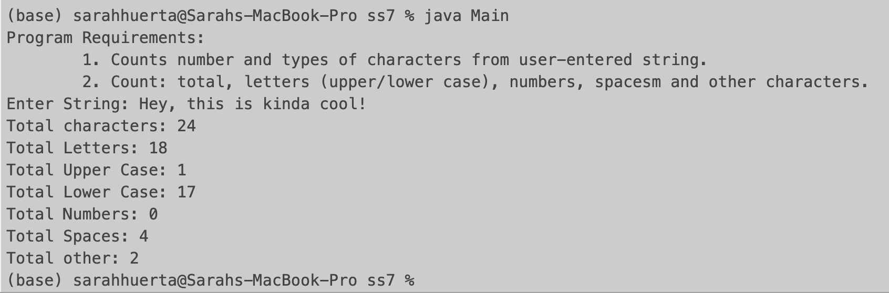
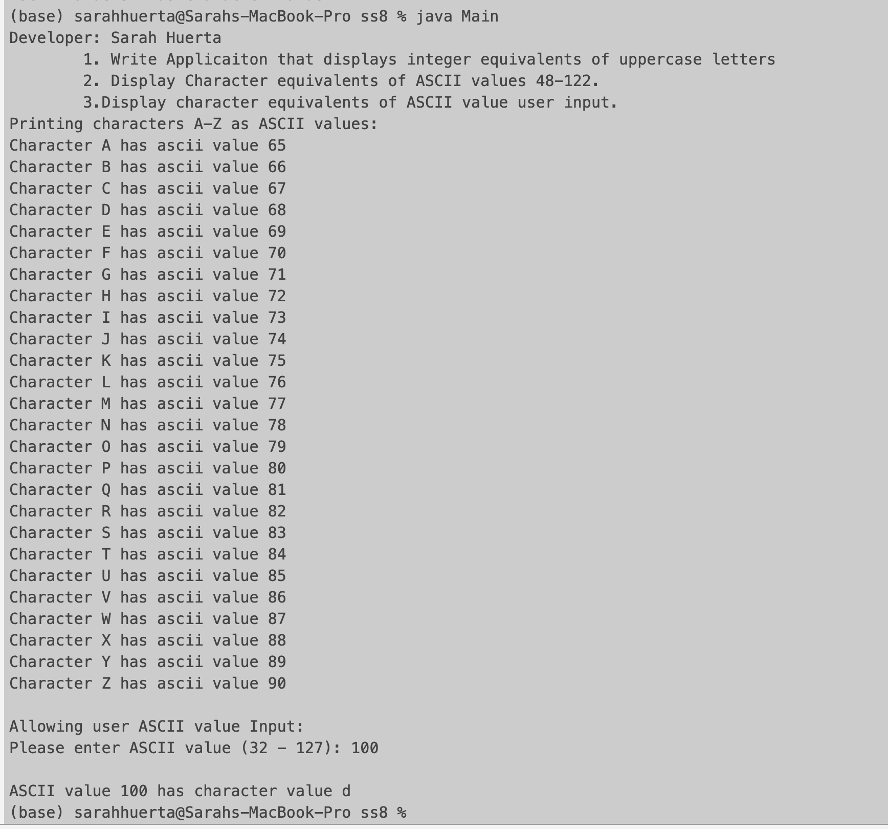
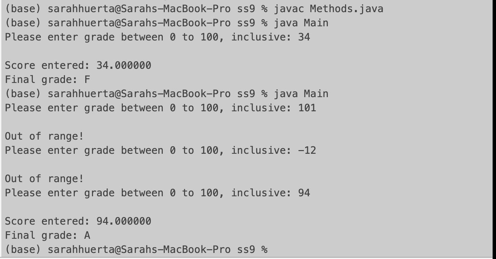

# LIS4368 - Advanced Web Application Development

## Sarah Huerta

### Project Requirements:

*Four Parts*

1. Create Online Portfolio using Tomcat and Java Servlets
2. Use jQuery to validate client side data
3. Link to local host web Application
4. Skill Set 7-9

#### Assignment Screenshots:

*Link to Local LIS4368 web app*

[A4 Local LIS4368 web app](http://localhost:9999/lis4368/index.php)

*Screenshot of Online Portfolio*:

| Main Page |
| ----------------------------------- |
|  |

| Pre-Data Validation | Passed Validation |
| ----------------------------------- |  ----------------------------------- |
|   |  |

*Skill Set 7-9*

| Skill Set 7 | Skill Set 8 | Skill Set 9 |
| -----------------------------------| ----------------------------------- | ----------------------------------- |
|  |  |  |
