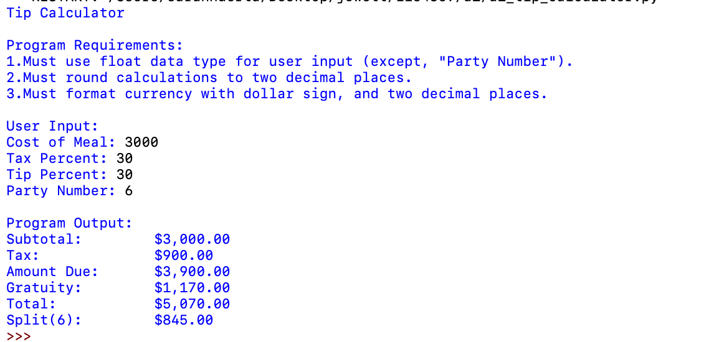
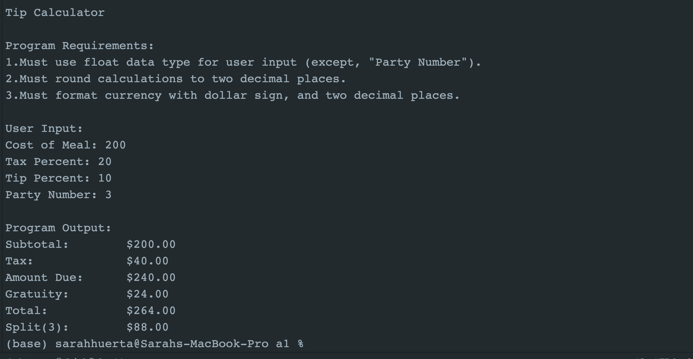
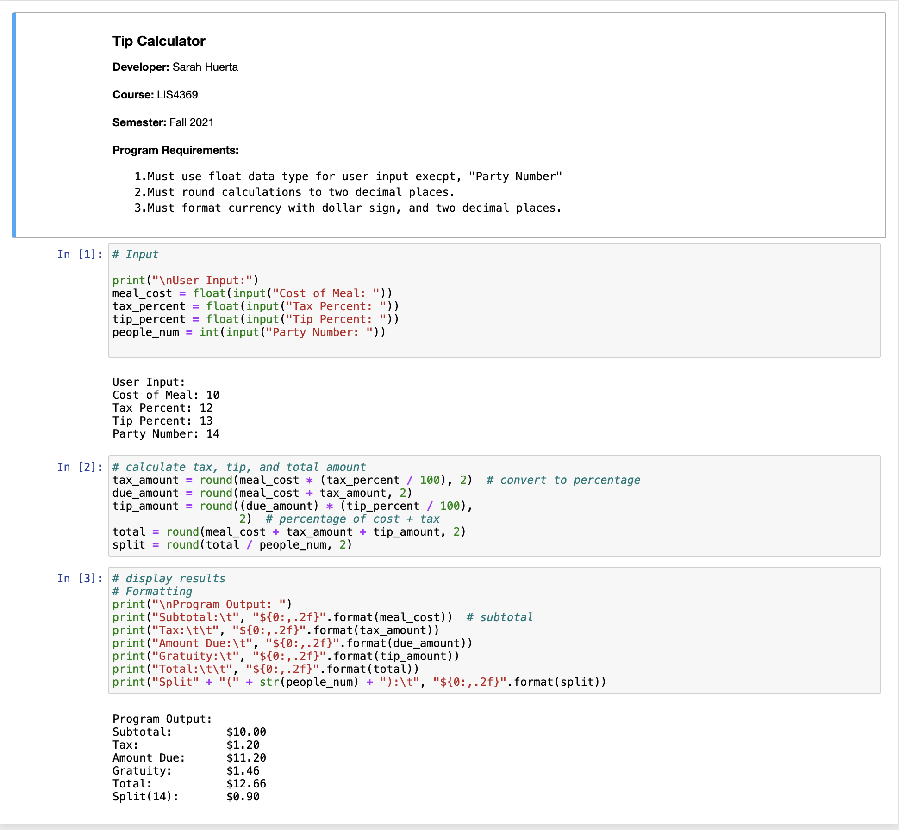

> **NOTE:** This README.md file should be placed at the **root of each of your repos directories.**
>
>Also, this file **must** use Markdown syntax, and provide project documentation as per below--otherwise, points **will** be deducted.
>

# LIS4369 - Extensible Enterprise Solutions

## Sarah Huerta

### Assignment 1 Requirements:

*Four Parts*

1. Distributed Version Control with Git and Bitbucket
2. Development Installations
3. Questions
4. Bitbucket repo links:

    a) this assignment and
    b) the completed tutorial (bitbucketstationlocations).

#### README.md file should include the following items:

    * Screenshot of a1_tip_calculator application running
    * Link to A1 .ipynb file: tip_calculator.ipynb
    * git commands w/short descriptions

> This is a blockquote.
>
> This is the second paragraph in the blockquote.
>
> #### Git commands w/short descriptions:

    1. git init - Create an empty Git repository or reinitialize an
           existing one
    2. git status - Show the working tree status
    3. git add - Add file contents to the index
    4. git commit - Record changes to the repository
    5. git push - Update remote refs along with associated objects
    6. git pull - Fetch from and integrate with another repository or a
           local branch
    7. git merge - Join two or more development histories together

#### Assignment Screenshots:

*Screenshot of a1_tip_calculator application running (IDLE)*:

*Screenshot of running a1_tip_calculator running (Atom)*:

*A1 Jupyter Notebook*:

#### Tutorial Links:

*Bitbucket Tutorial - Station Locations:*
[A1 Bitbucket Station Locations Tutorial Link](https://bitbucket.org/sah16m/bitbucketstationlocations/ "Bitbucket Station Locations")
