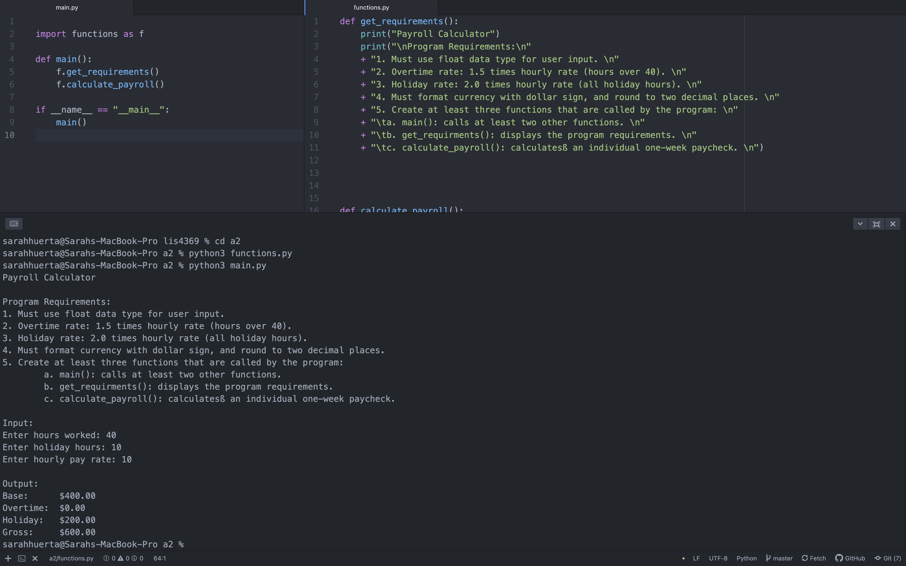
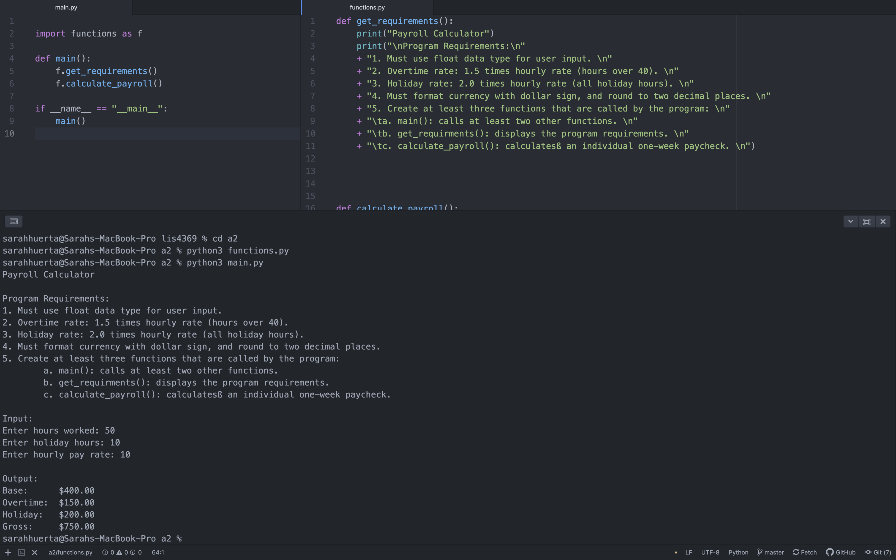
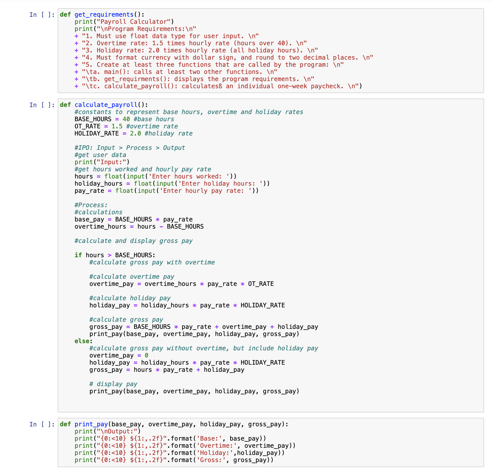
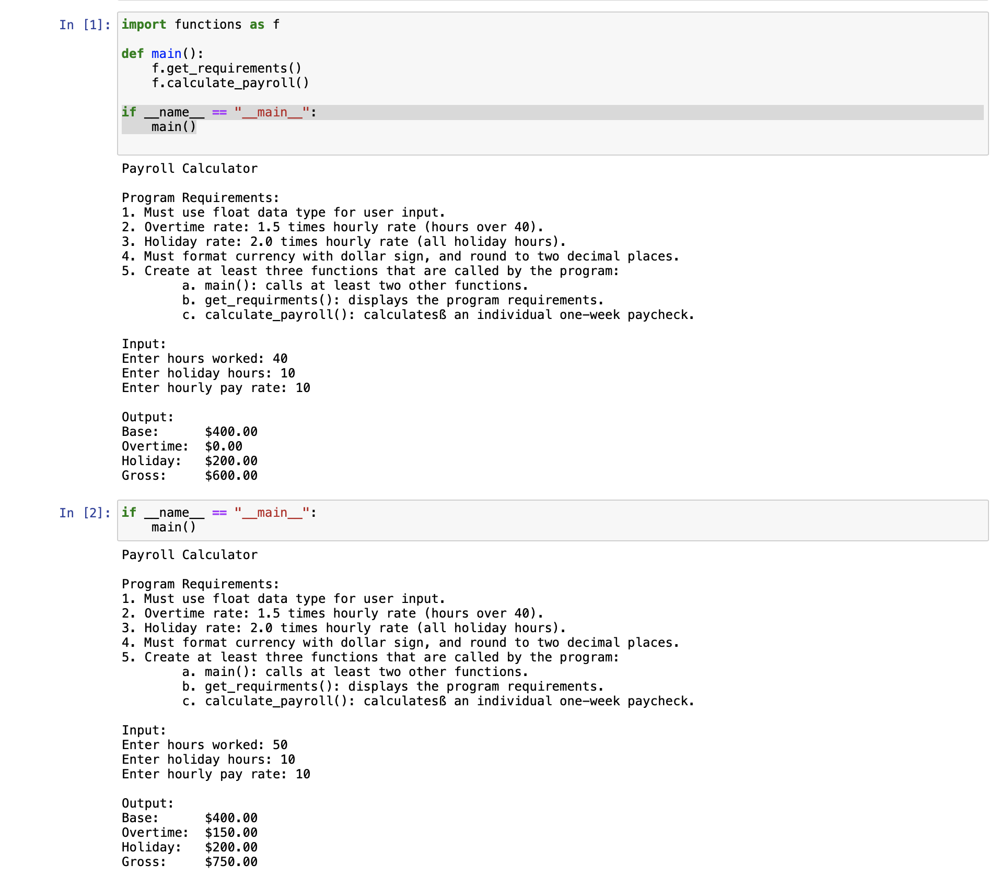

> **NOTE:** This README.md file should be placed at the **root of each of your repos directories.**
>
>Also, this file **must** use Markdown syntax, and provide project documentation as per below--otherwise, points **will** be deducted.
>

# LIS4369 - Extensible Enterprise Solutions

## Sarah Huerta

### Assignment 2 Requirements:

*Three Parts*

#### README.md file should include the following items:

* Screenshot of Python Payroll Calculator
* Link to A2 .ipynb file: a2_payroll.ipynb
* Bitbucket Link to skill sets 1-3

#### Assignment Screenshots:

*Screenshot of Python Payroll Calculator Running in Atom:*

*Link to A2 .ipynb file a2_payroll.ipynb:*

*Skill Sets 1-3 Repositories*

[Skill Sets 1-3 Link](https://bitbucket.org/sah16m/lis4369/src/master/skill_sets/)
