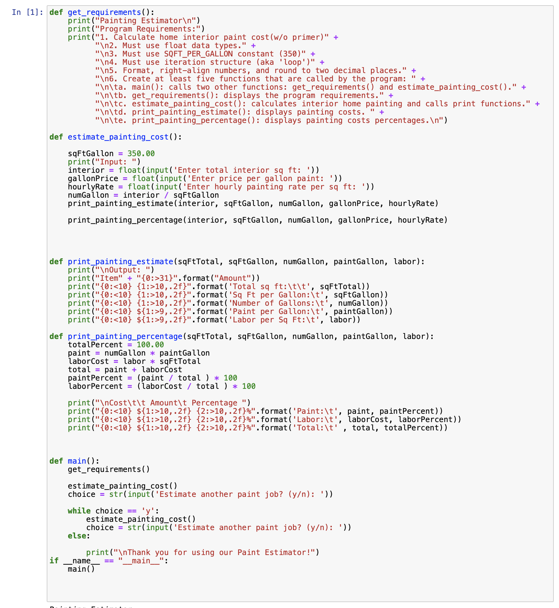
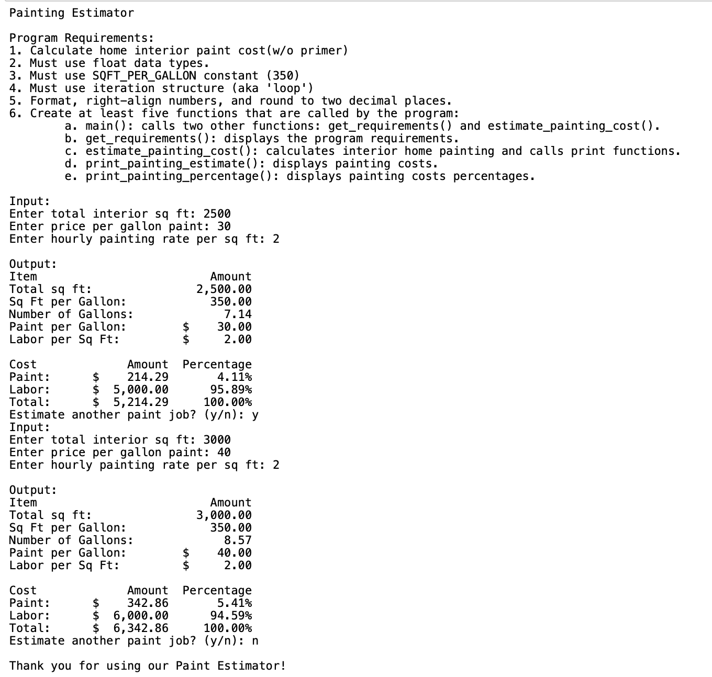
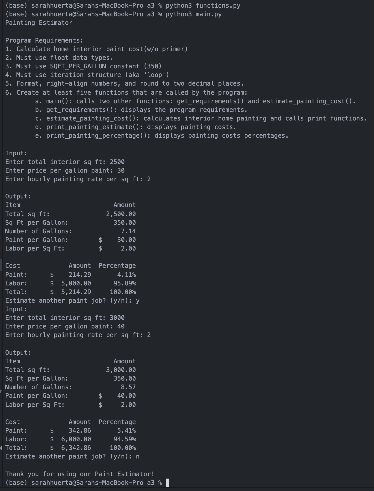
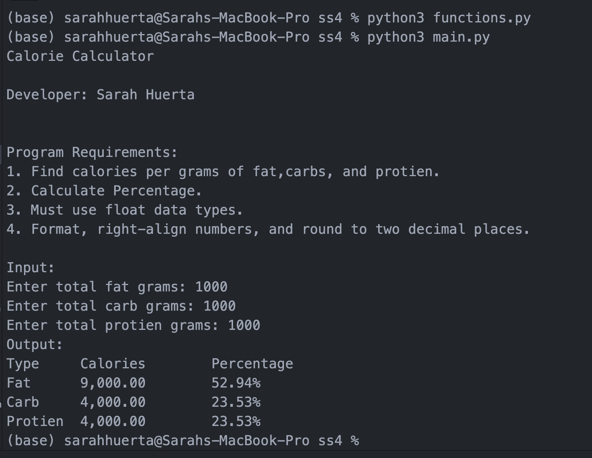
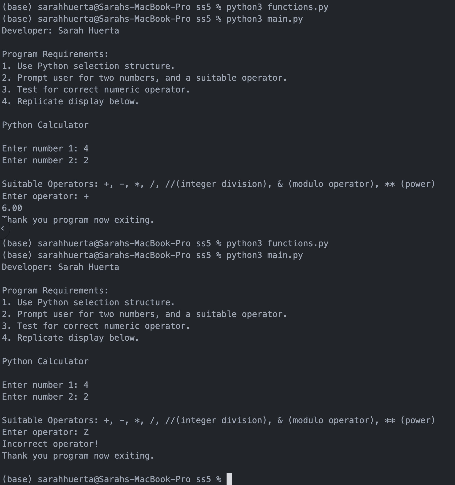
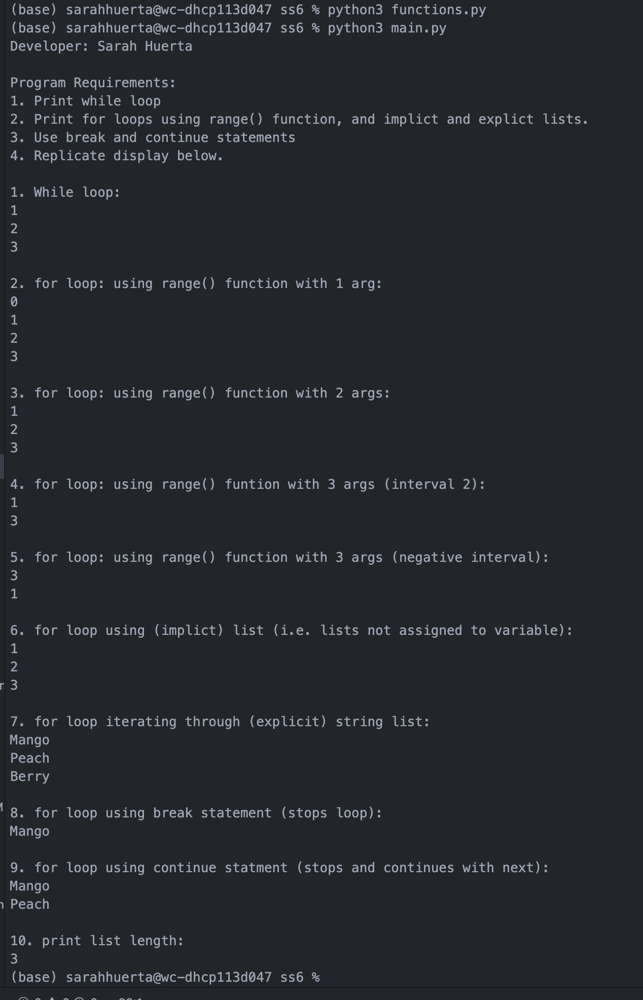

> **NOTE:** This README.md file should be placed at the **root of each of your repos directories.**
>
>Also, this file **must** use Markdown syntax, and provide project documentation as per below--otherwise, points **will** be deducted.
>

# LIS4369 - Extensible Enterprise Solutions

## Sarah Huerta

### Assignment 3 Requirements:

*Three Parts*

1. A3 Paint Calculator
2. Screenshot of A3 Jupyter Notebook
3. Skill Sets 4-6

#### Assignment Screenshots:

| Jupyter Notebook Screenshot 1 | Jupyter Notebook Screenshot 2 |
| -----------------------------------| ----------------------------------- |
|  |  |

*Screenshot of A3 Paint Calculator*:

*Skill Set 4-6*

| Skill Set 4 | Skill Set 5 | Skill Set 6 |
| -----------------------------------| ----------------------------------- | ----------------------------------- |
|  |  |  |
