> **NOTE:** This README.md file should be placed at the **root of each of your repos directories.**
>
>Also, this file **must** use Markdown syntax, and provide project documentation as per below--otherwise, points **will** be deducted.
>

# LIS4369 - Extensible Enterprise Solutions

## Sarah Huerta

### Assignment 2 Requirements:

*Five Parts*

1. Run demo.py
2. If errors, more than likely missing installations.
3. Test Python Package installer: pip freeze
4. Create at least three functions that are called by the program:
    * main(): calls at least two other functions.
    * get_requirements(): displays the program requirements.
    * data_analysis_2(): displays the following data.

#### Assignment Screenshots:
*Screenshot of A4 Jupyter Notebook*:

| Jupyter Notebook Screenshot 1 | Jupyter Notebook Screenshot 2 |
| ---------------------------------------| --------------------------------------- |
| 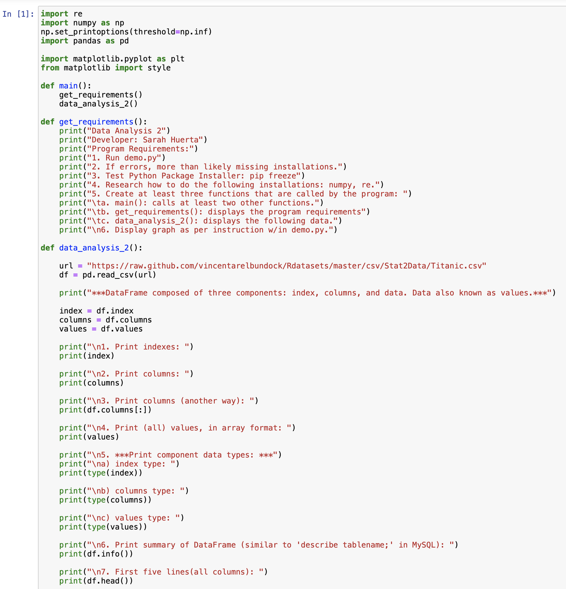 | 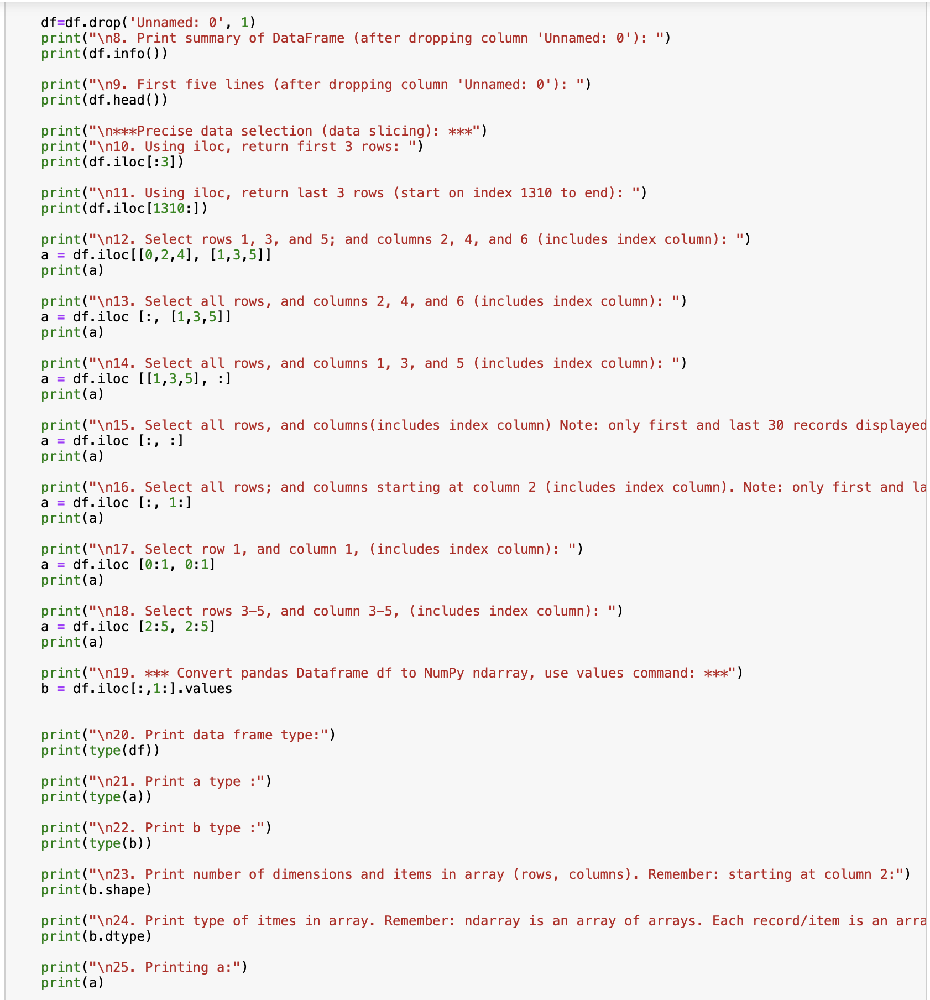  |

| Jupyter Notebook Screenshot 3 | Jupyter Notebook Screenshot 4 |
| ---------------------------------------| --------------------------------------- |
| 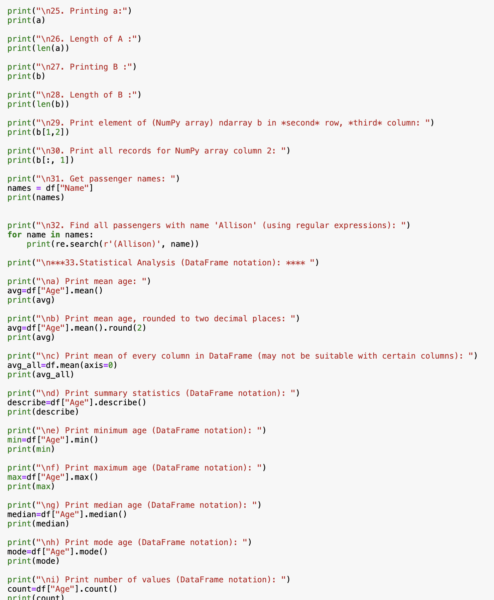 | 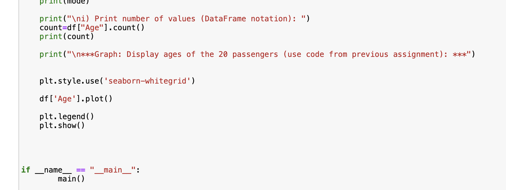  |

*Screenshot of a4 Data Analysis 2*:

| Screenshot 1 |  Screenshot 2 | Screenshot 3 |
| -----------------------------------| ----------------------------------- | ----------------------------------- |
| 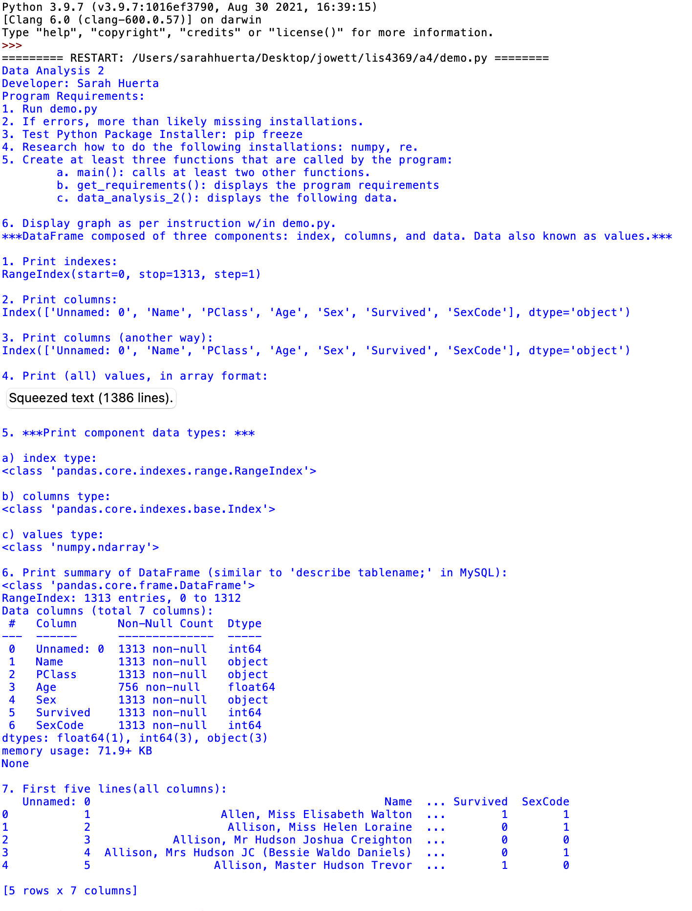 | 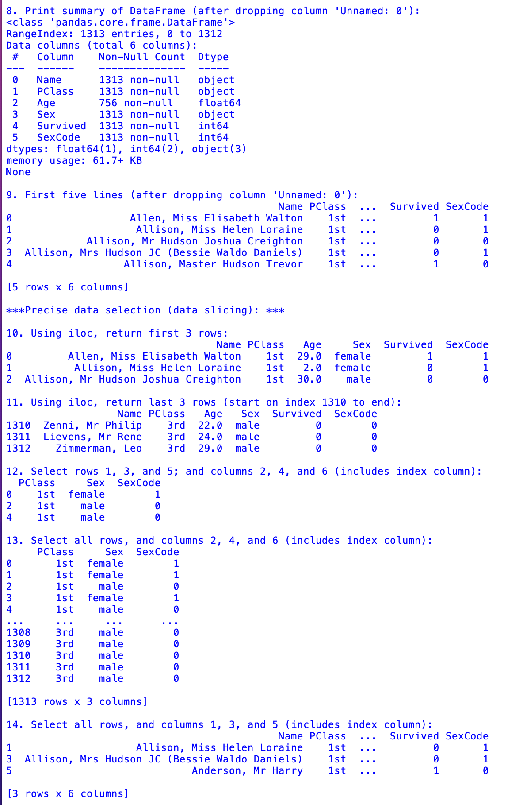 | 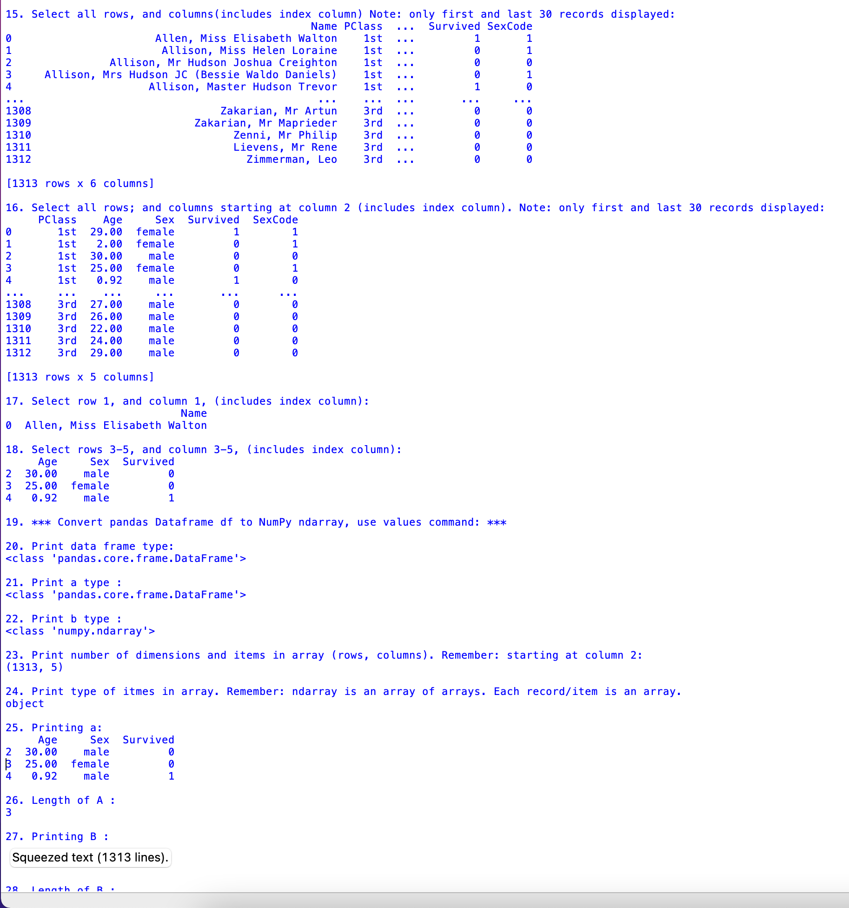 |

| Screenshot 4 |  Screenshot 5 | Graph |
| -----------------------------------| ----------------------------------- | ----------------------------------- |
| 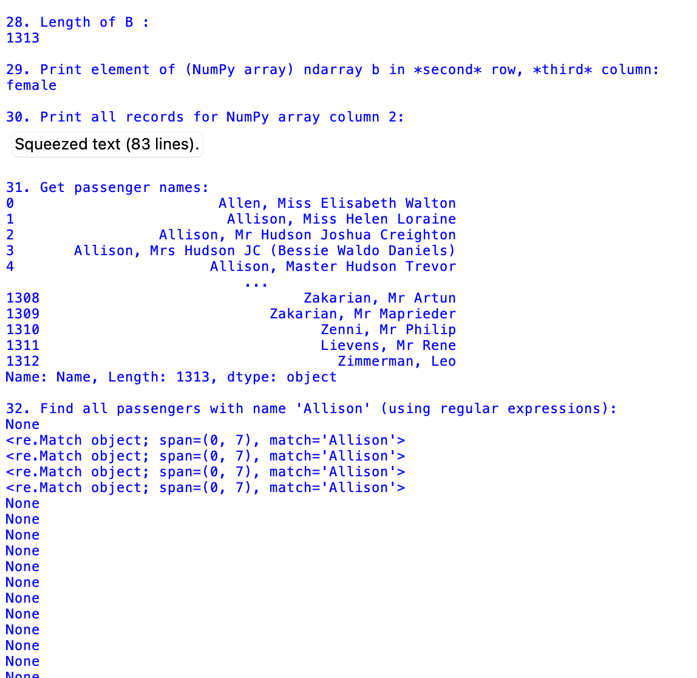 | 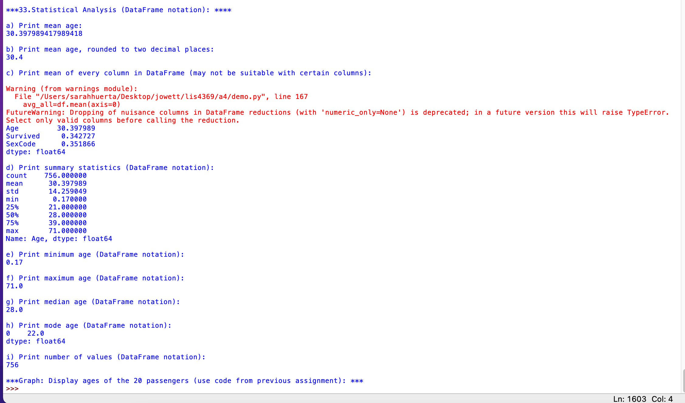 | 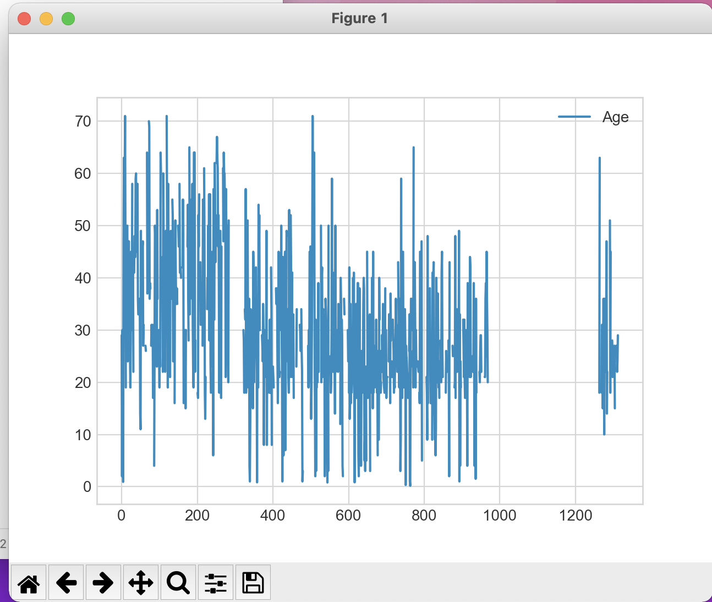 |

*Skill Set 10-12*

| Skill Set 10 | Skill Set 11 | Skill Set 12 |
| -----------------------------------| ----------------------------------- | ----------------------------------- |
| 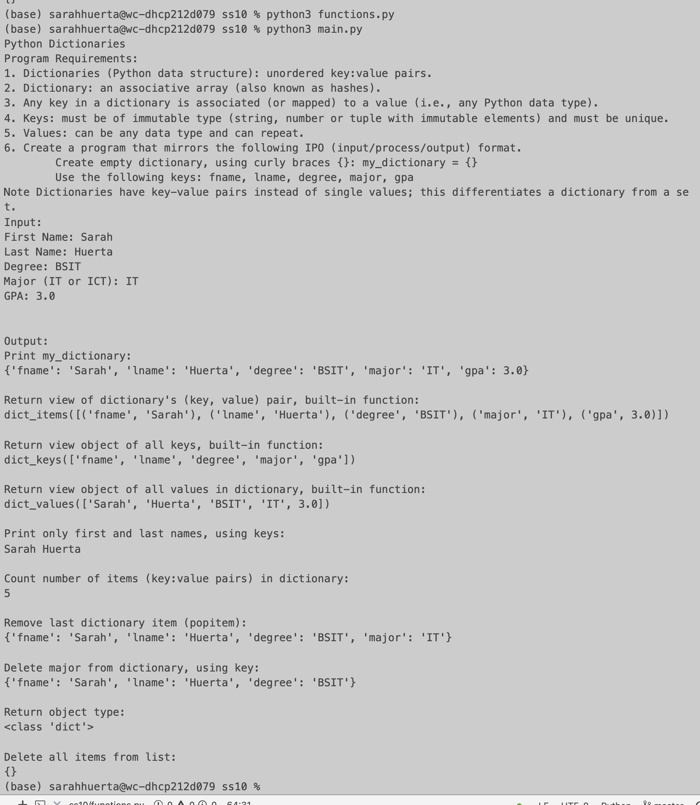 | 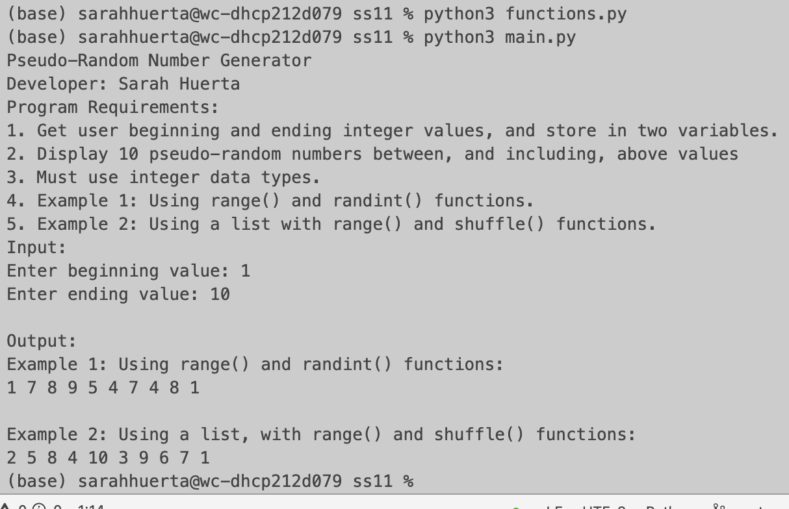 | 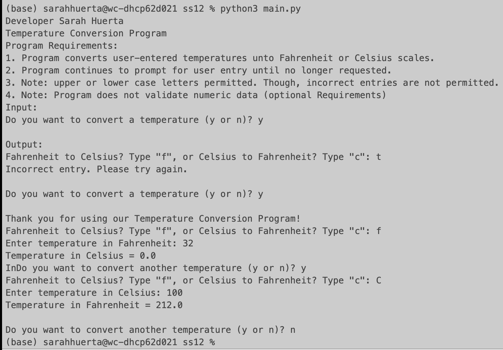 |
