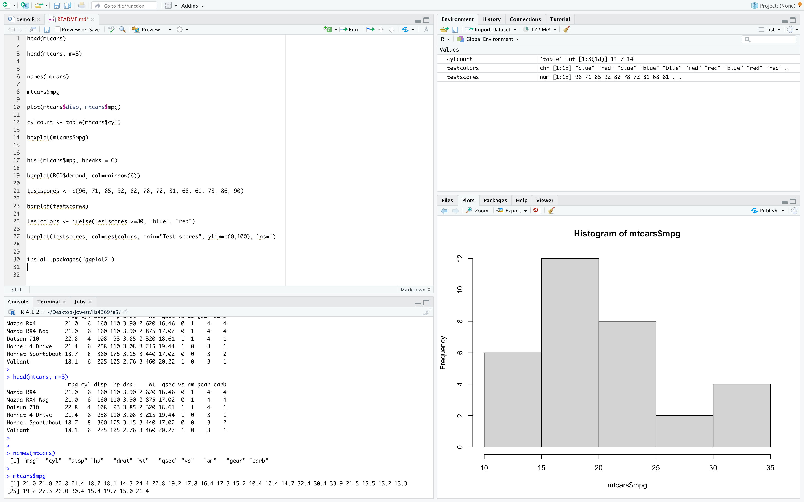
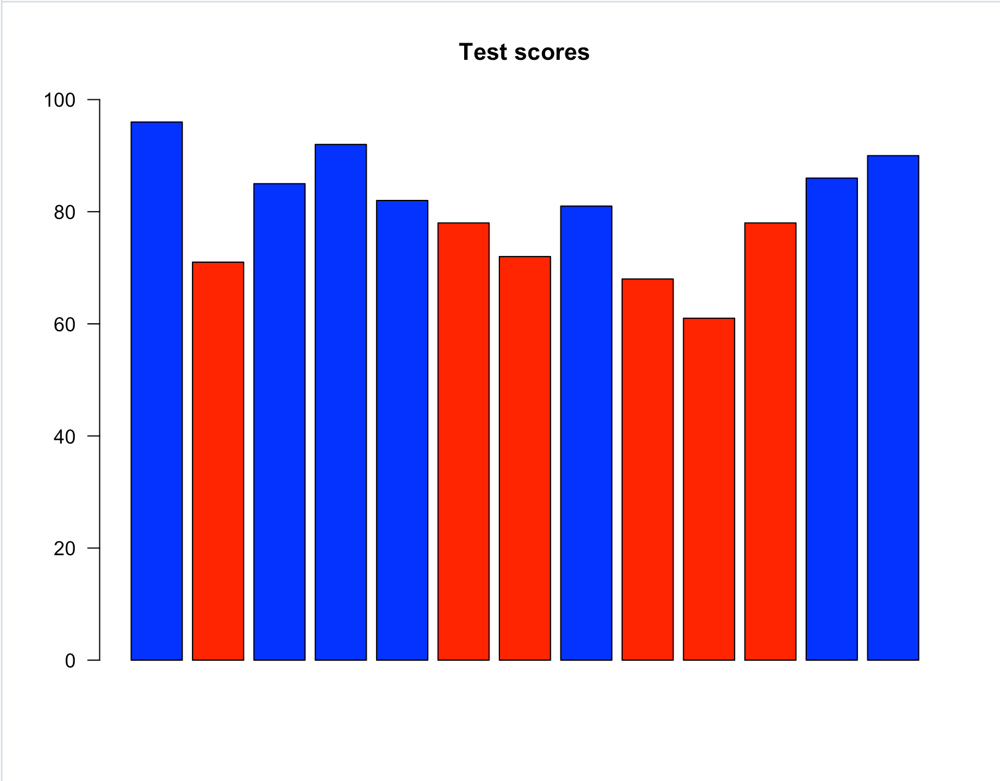
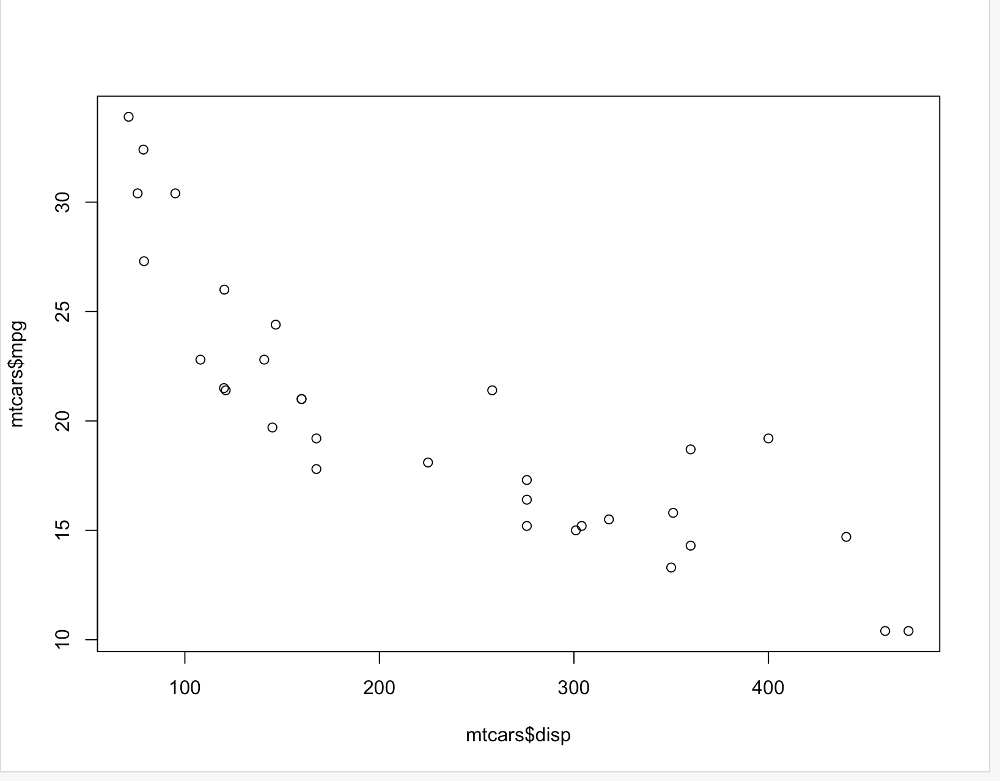
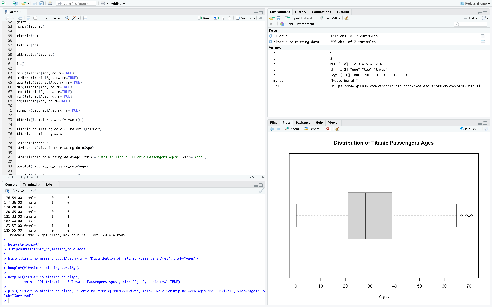
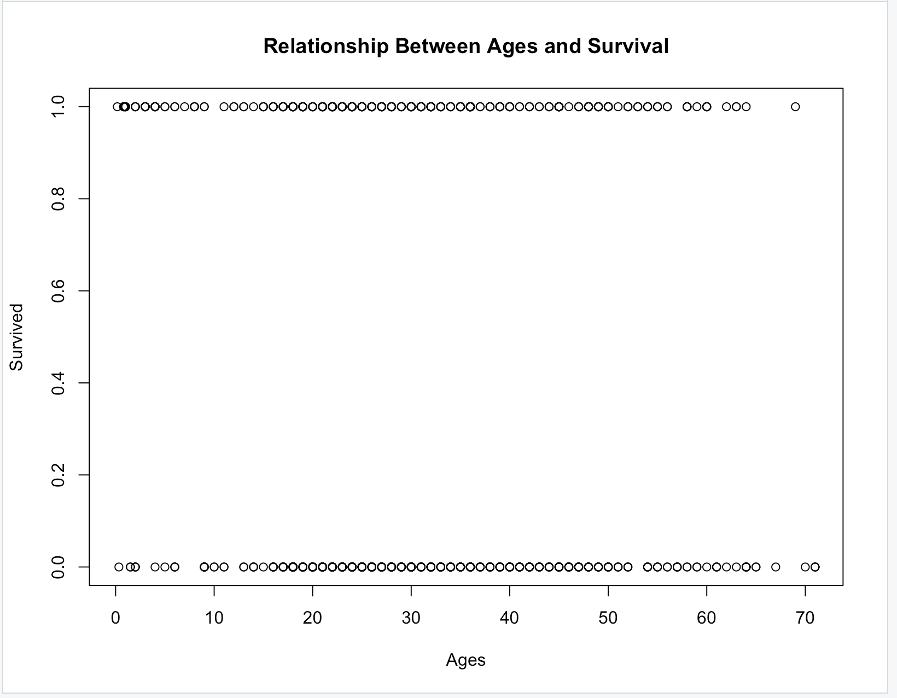
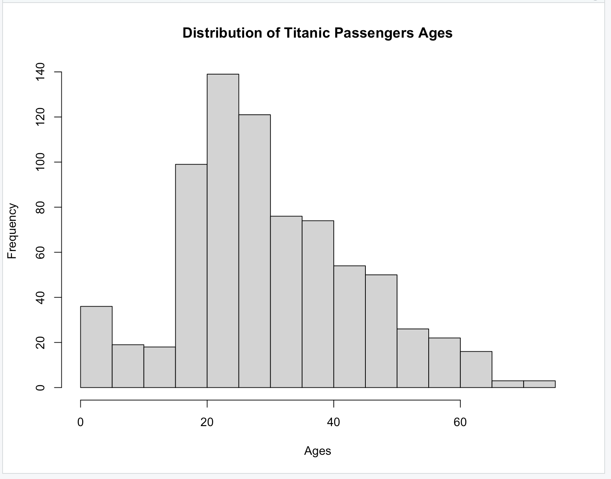
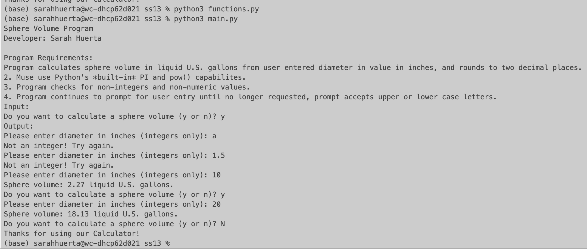
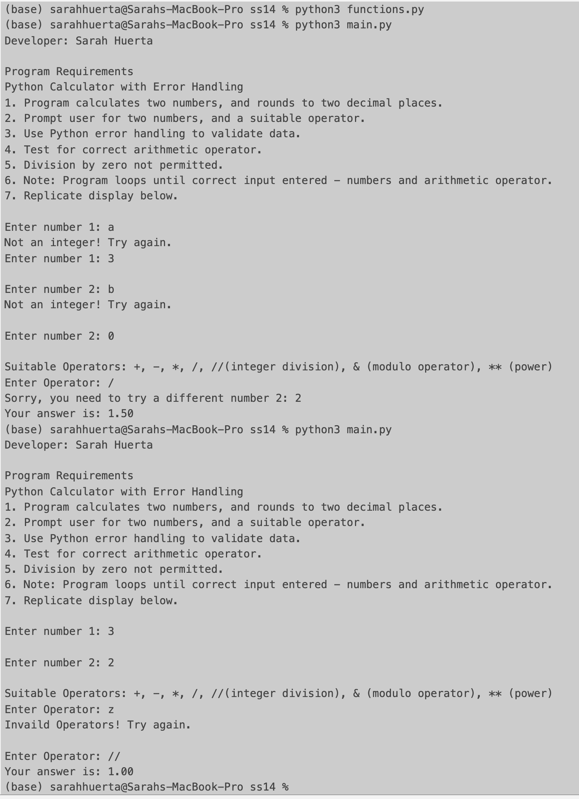
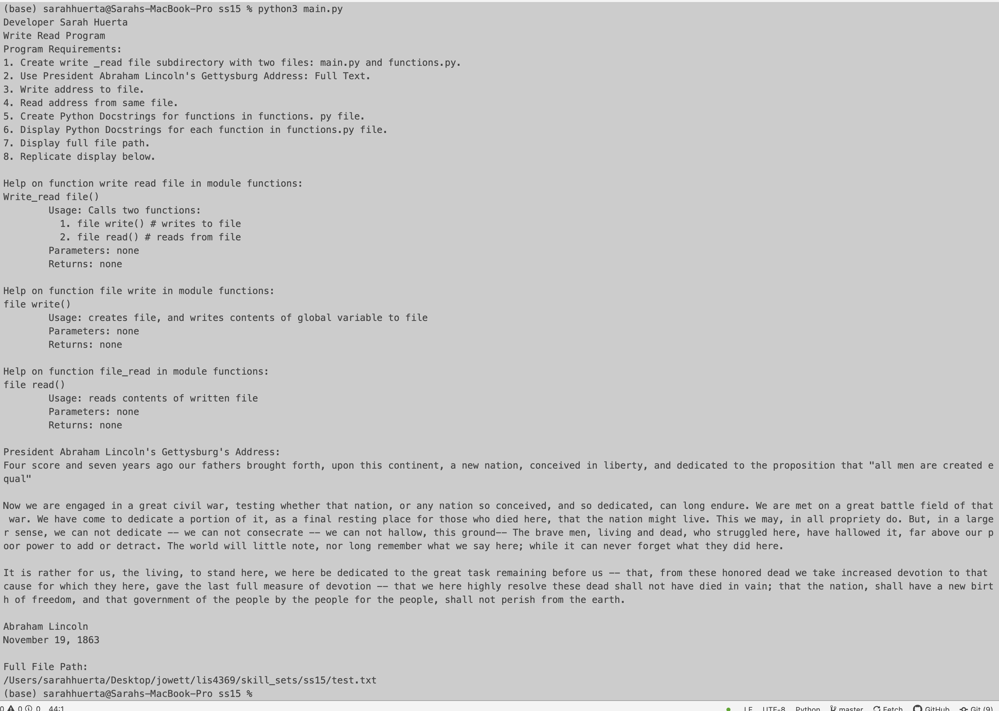

# LIS4369 - Extensible Enterprise Solutions
## Sarah Huerta
### Assignment 5 Requirements:

    1.  Set up and install R Studio
    2.  Run lis4369_a5.R and learn_to_use_r.R
    3.  Display graphs and output
    4.  Skill sets 13-15

#### Assignment Screenshots:

#### Screenshot of RStudio Output for Learn to Use R:

| Learn to Use R Panel |  Graph 1 | Graph 2 |
| -----------------------------------| ----------------------------------- | ----------------------------------- |
|  |  |  |

#### Screenshot of Titanic Data Output:

| Titanic Four Panel Image |  Titanic Graph 1 | Titanic Graph 2 |
| -----------------------------------| ----------------------------------- | ----------------------------------- |
|  |  |  |

#### Skill Set 13-15

| Skill Set 13 | Skill Set 14 | Skill Set 15 |
| -----------------------------------| ----------------------------------- | ----------------------------------- |
|  |  |  |
