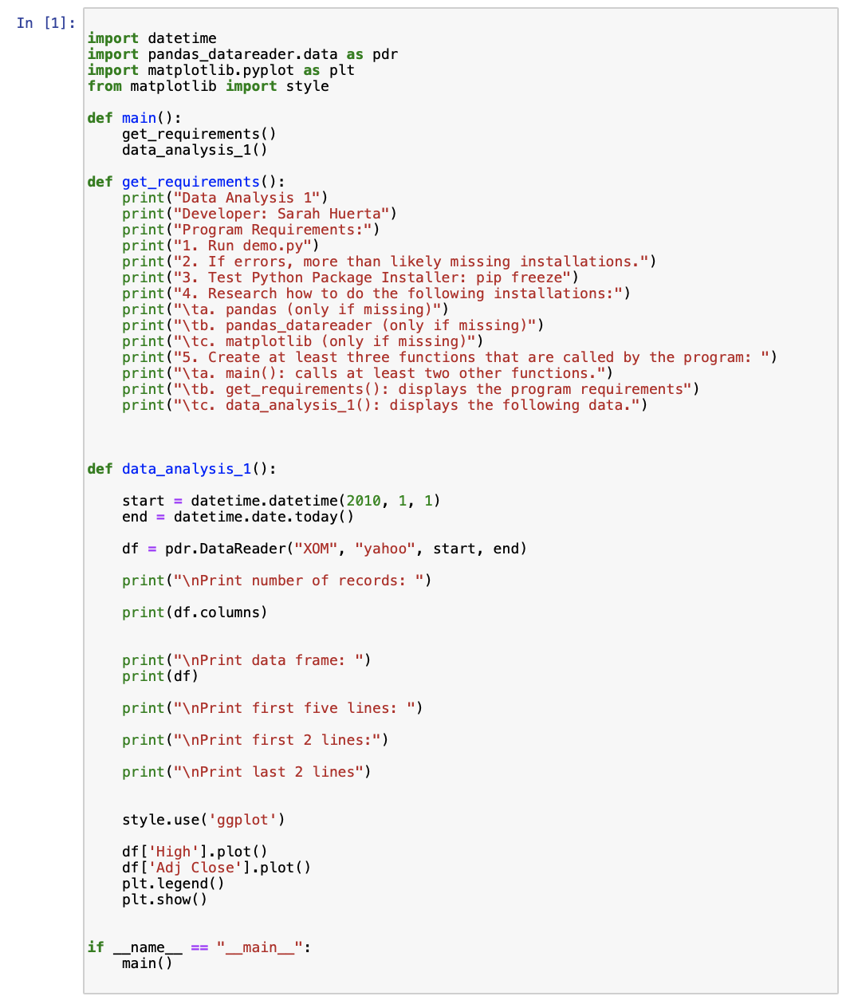
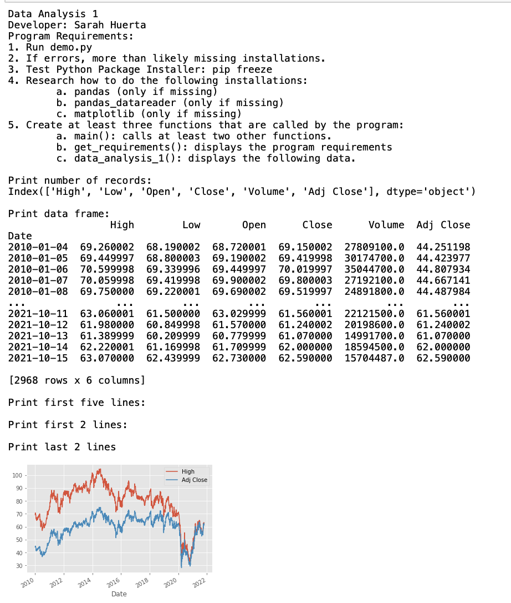
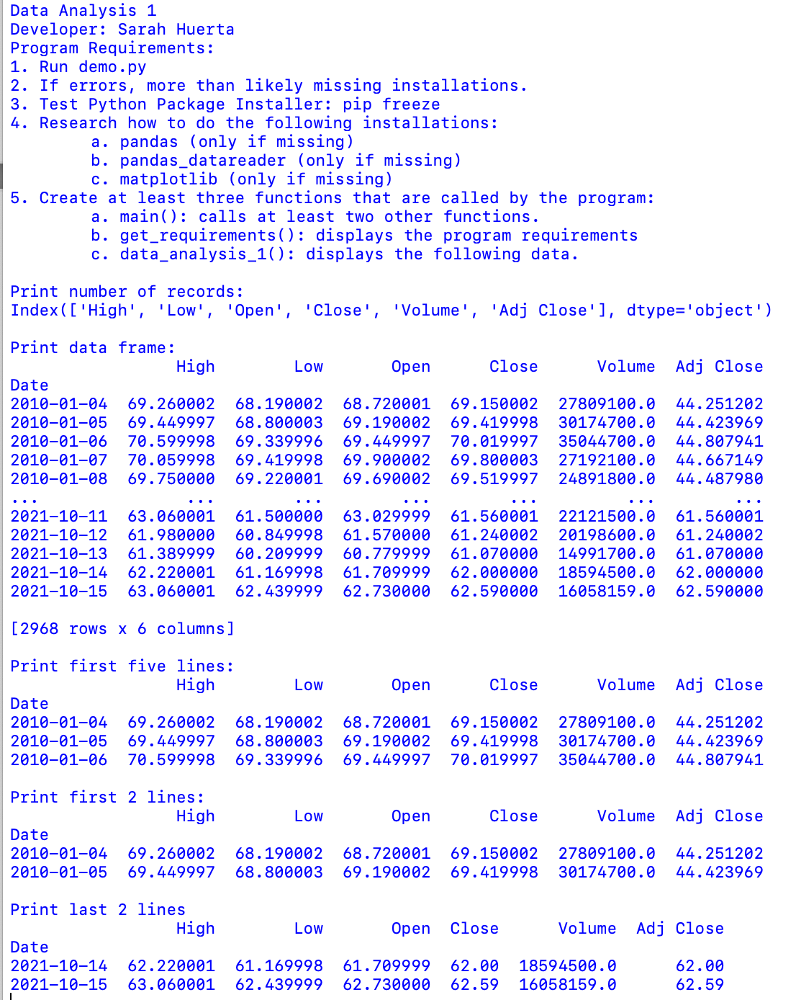
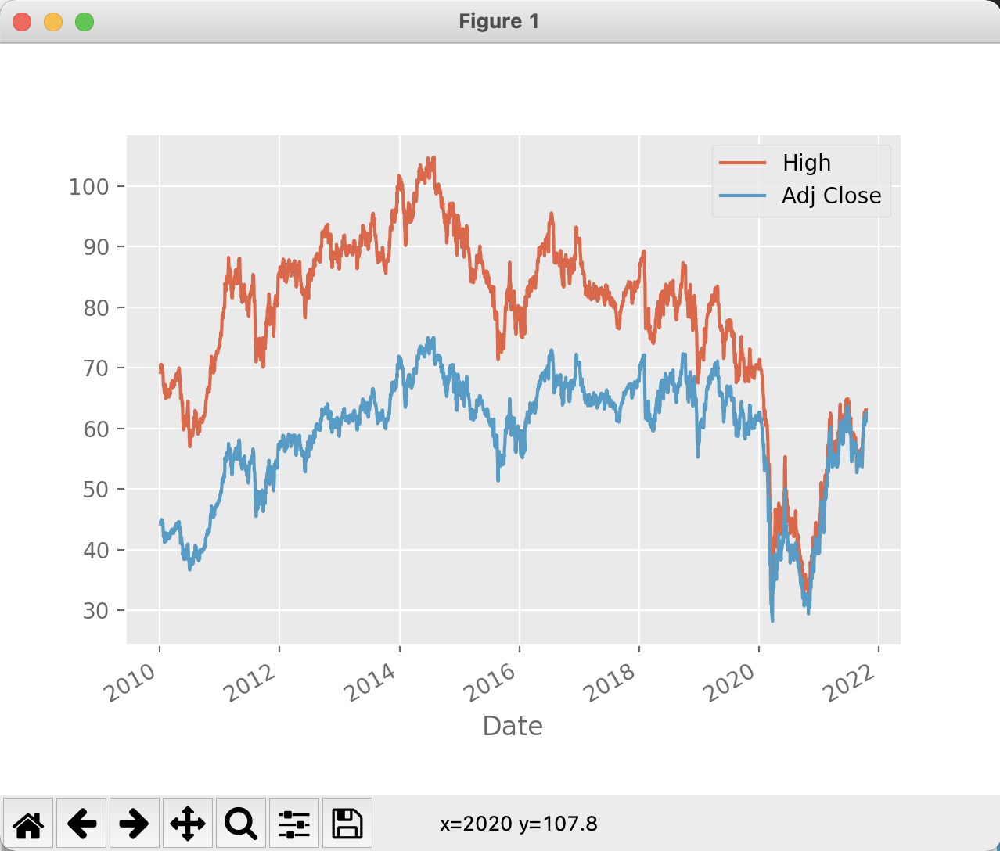
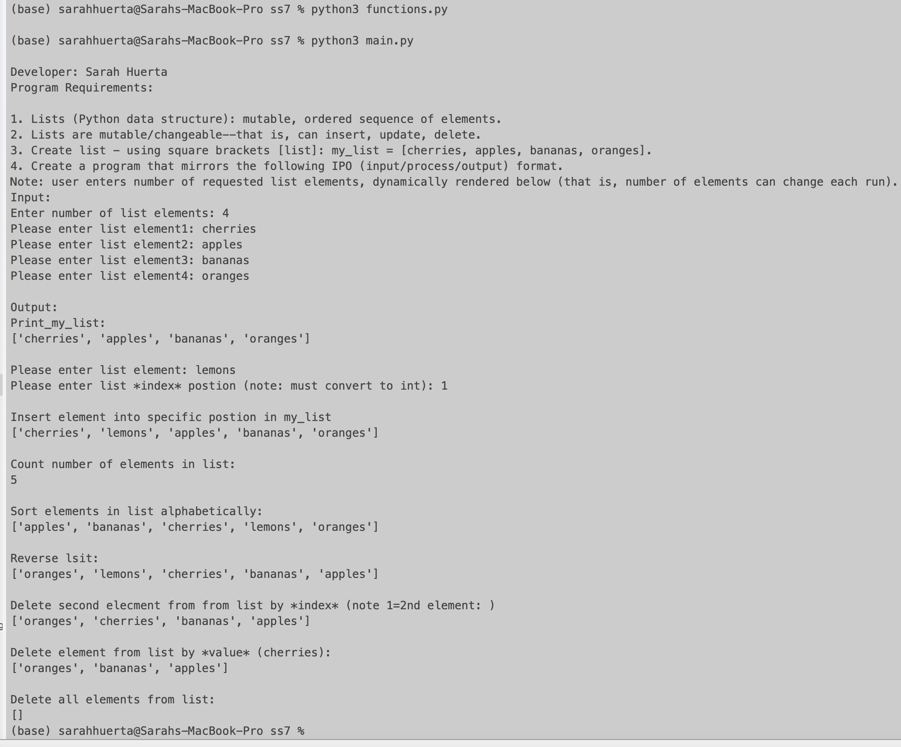
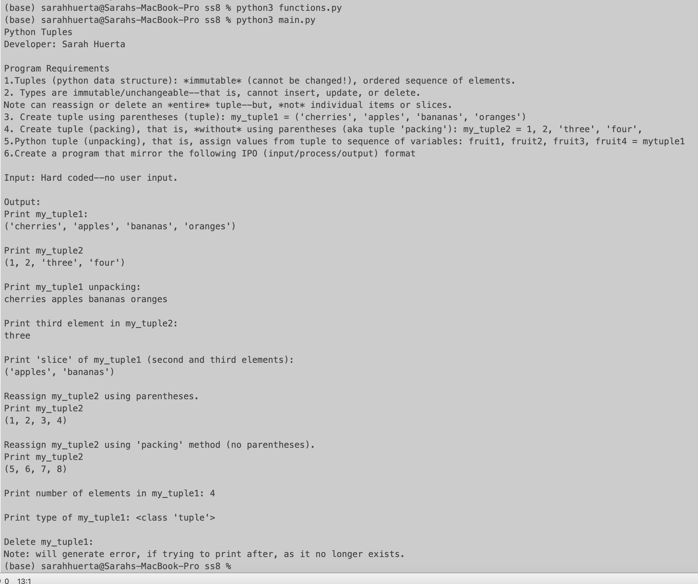
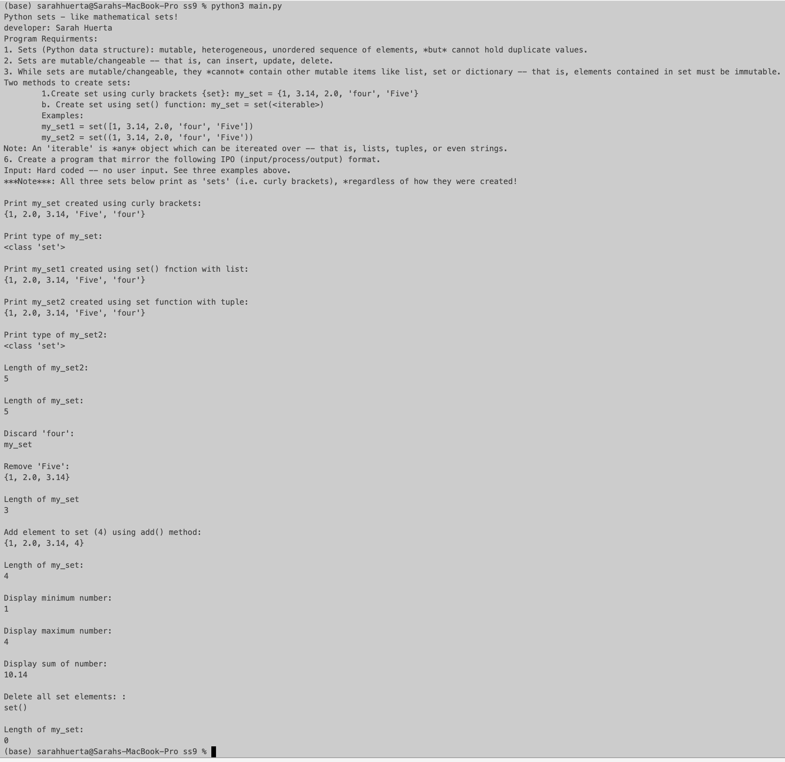

> **NOTE:** This README.md file should be placed at the **root of each of your repos directories.**
>
>Also, this file **must** use Markdown syntax, and provide project documentation as per below--otherwise, points **will** be deducted.
>

# LIS4369 - Extensible Enterprise Solutions

## Sarah Huerta

### Project 1 Requirements:

*Five Parts*

1. Run demo.py
2. If errors, more than likely missing installations.
3. Test Python Package installer: pip freeze
4. Research how to do the following installations:
    * pandas (only if missing)
    * pandas-datareader (only if missing)
    * matplotlib (only if missing)
5. Create at least three functions that are called by the program:
    * main(): calls at least two other functions.
    * get_requirements(): displays the program requirements.
    * data_analysis_1(): displays the following data.

#### Assignment Screenshots:
*Screenshot of P1 Jupyter Notebook*:

| Jupyter Notebook Screenshot 1 | Jupyter Notebook Screenshot 2 |
| ---------------------------------------| --------------------------------------- |
|  |   |

*Screenshot of P1 Data Analysis 1*:

| Screenshot 1 |  Screenshot 2 |
| -----------------------------------| ----------------------------------- |
|  |  |

*Skill Set 7-9*

| Skill Set 7 | Skill Set 8 | Skill Set 9 |
| -----------------------------------| ----------------------------------- | ----------------------------------- |
|  |  |  |
