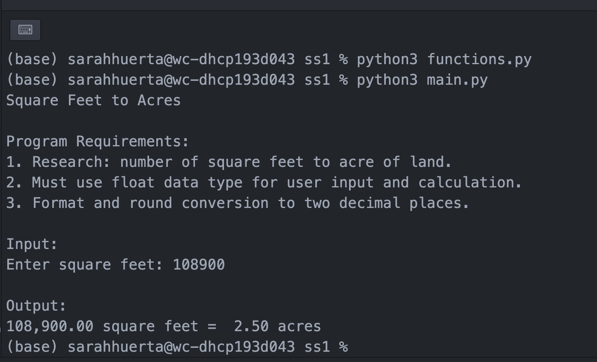
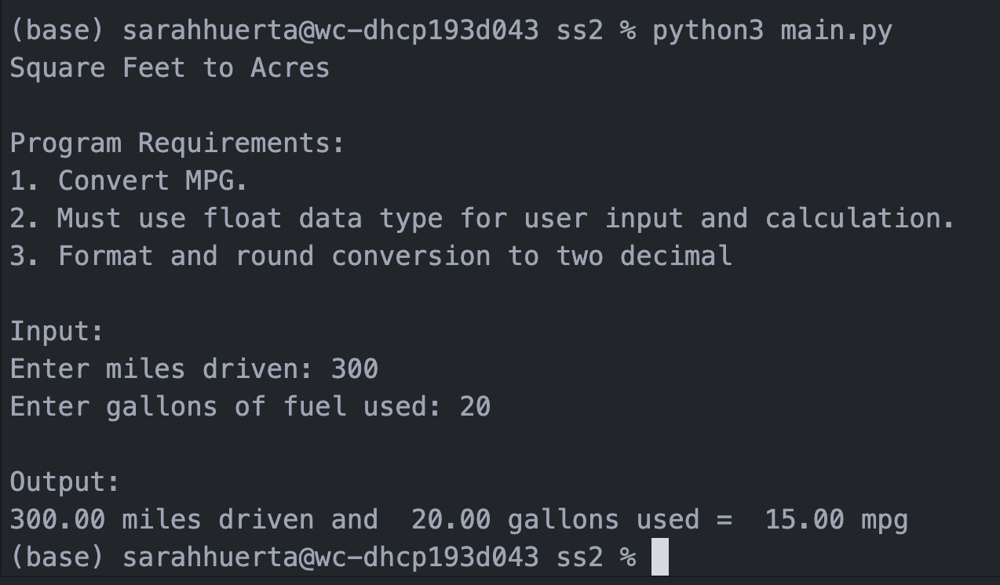
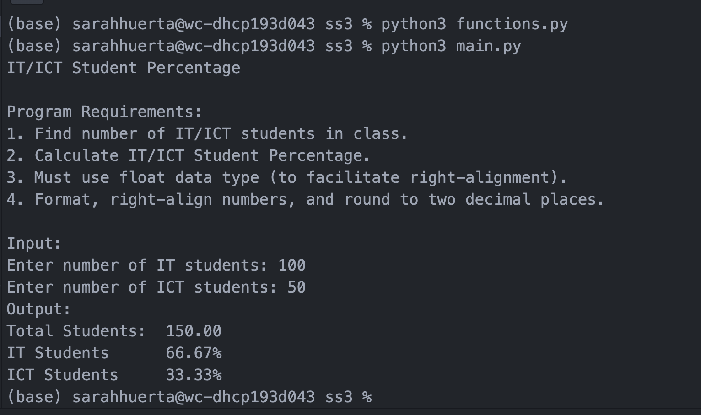
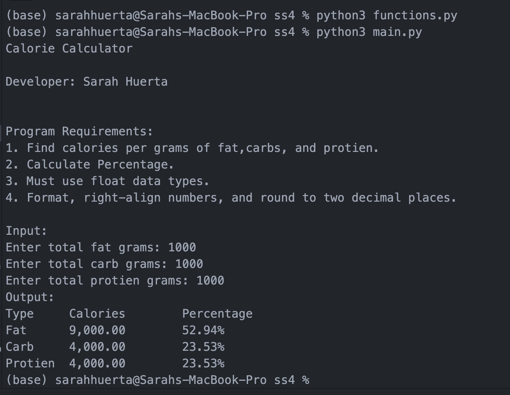
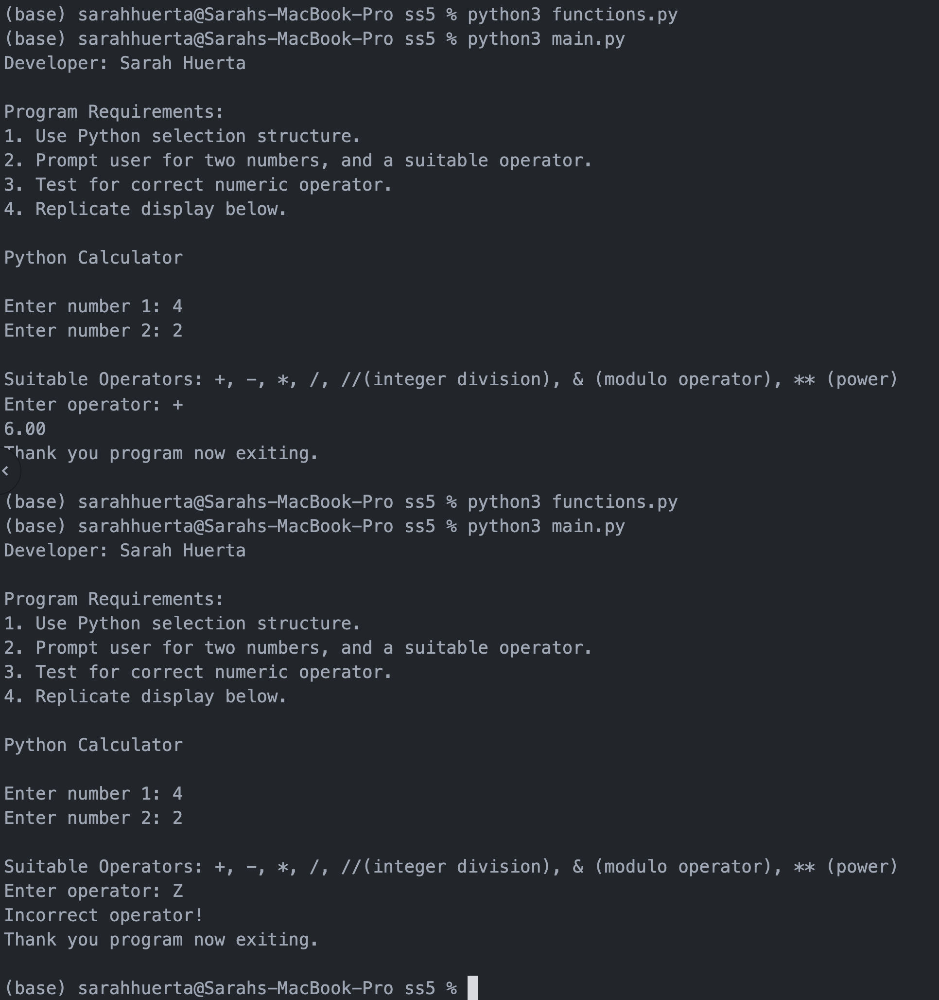
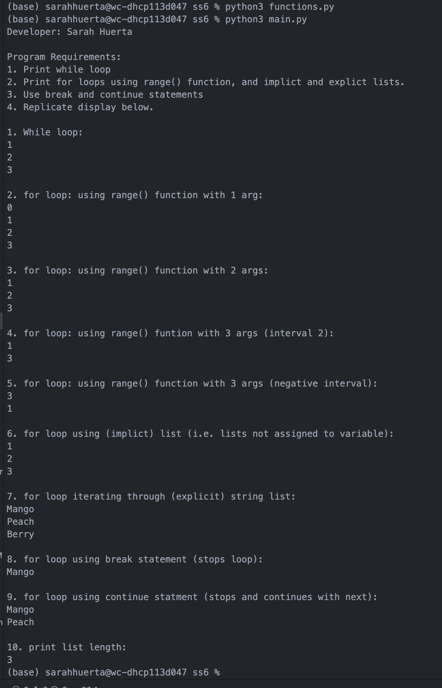

> **NOTE:** This README.md file should be placed at the **root of each of your repos directories.**
>

# LIS4369 - Extensible Enterprise Solutions (Python)

## Sarah Huerta

### LIS4369

*Skill Set Assignments*

*Skill Set 1: Square Feet to Acres*

*Skill Set Two: Miles Per Gallon*

*Skill Set Three: IT/ICT Student Percentage Calculator*

*Skill Set Four: Calorie Percentage*

*Skill Set Five: Python Selection structure*

*Skill Set Six: Python Loops*

*Future Skill sets to be added soon*
