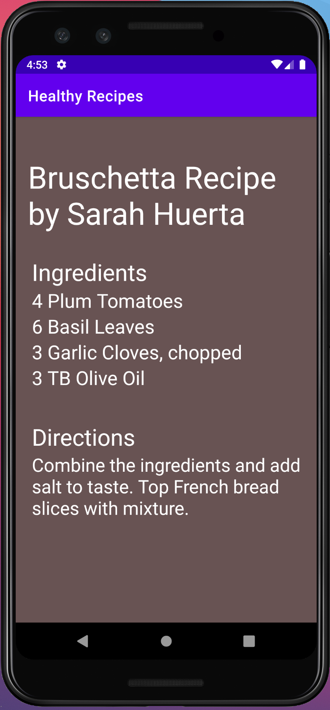

> **NOTE:** This README.md file should be placed at the **root of each of your repos directories.**
>
>Also, this file **must** use Markdown syntax, and provide project documentation as per below--otherwise, points **will** be deducted.
>

# LIS4381 - Mobile Web Application Development

## Sarah Huerta

### Assignment 2 Requirements:

*Two Parts*
1.   Screenshots of Android Studio "Healthy Recipe" App
2.   Skill Sets 1-3

#### Assignment Screenshots:

*Screenshot of Android Studio - Healthy Recipe App*:

*Screen 1*

*Screen 2*

*Link to Skill Set 1-3*
[Skill Sets 1-3 Link](https://bitbucket.org/sah16m/lis4381/src/master/skill_sets/)
