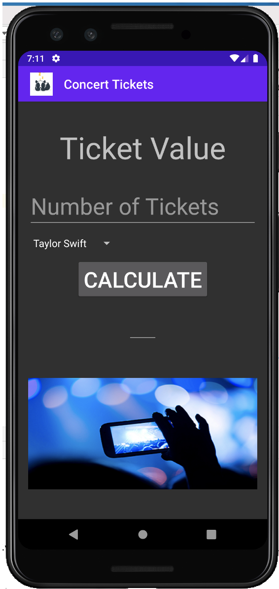
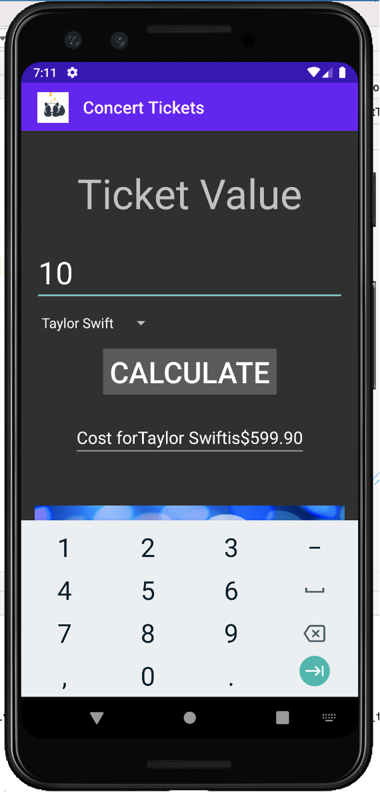
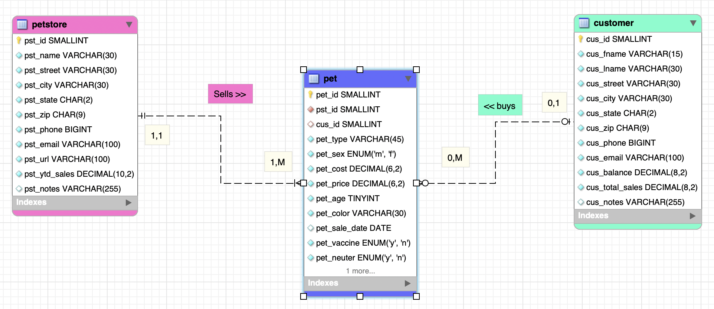
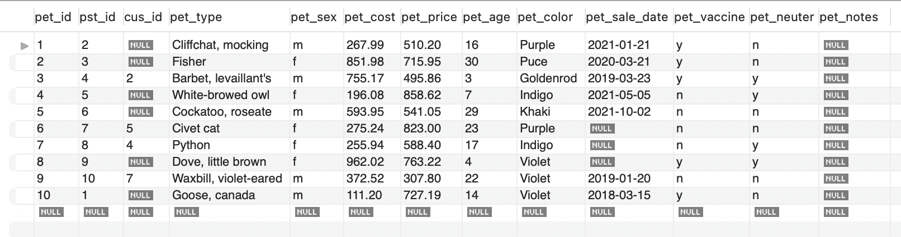
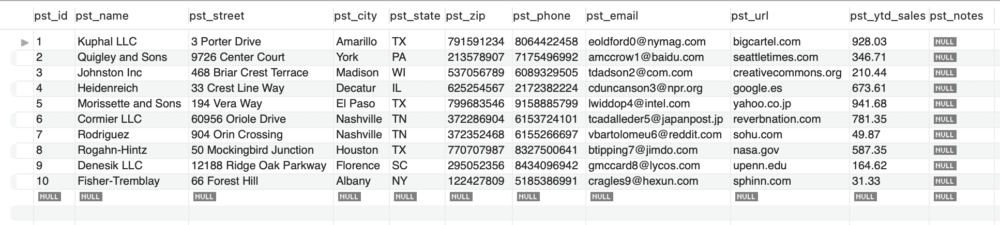
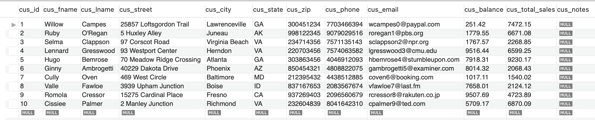

> **NOTE:** This README.md file should be placed at the **root of each of your repos directories.**
>
>Also, this file **must** use Markdown syntax, and provide project documentation as per below--otherwise, points **will** be deducted.
>

# LIS4381 - Mobile Web Application Development

## Sarah Huerta

#### Assignment 3 Requirements:

1. Screenshot of Pet Store ERD
2. Screenshot of Concert Ticket first and second user interface
3. Screen shots of 10 records from each Pet Store table
4. Links to a3.mwb and a3.sql

#### Assignment Screenshots:
| Screenshot 1 of Concert Ticket App | Screenshot 2 of Concert Ticket App |
| -----------------------------------| ----------------------------------- |
|  |  |

##### Screenshot of Pet Store ERD

#### Screenshot of 10 records from each Pet Store table

*Pet Table*

*Pet Store Table*

*Customer Table*

#### Links to a3.mwb and a3.sql files

[a3.sql file](https://bitbucket.org/sah16m/lis4381/src/master/a3/docs/a3.sql)

[a3.mwb file](https://bitbucket.org/sah16m/lis4381/src/master/a3/docs/a3.mwb)

##### Link to Skill Set 4-6

[Skill Sets 4-6 Link](https://bitbucket.org/sah16m/lis4381/src/master/skill_sets/)
