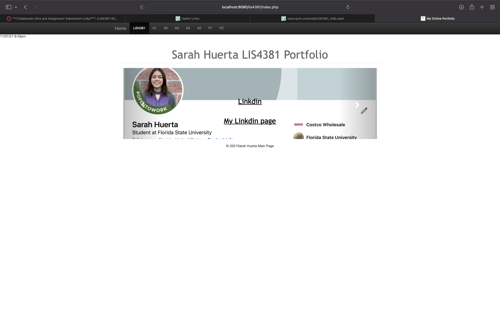

> **NOTE:** This README.md file should be placed at the **root of each of your repos directories.**
>
>Also, this file **must** use Markdown syntax, and provide project documentation as per below--otherwise, points **will** be deducted.
>

# LIS4381 - Mobile Web Application Development

## Sarah Huerta

### Assignment 4 Requirements:

*Four Parts*

1. Create Online Portfolio using Apache and Bootstrap
2. Use jQuery to validate client side data
3. Link to local host web app
4. Skill Set 10-12

#### Assignment Screenshots:

*Link to Local LIS4381 web app*

[A4 Local LIS4381 web app](http://localhost:8080/lis4381/index.php)

*Screenshot of Online Portfolio*:

| Main Page |  Pre-Data Validation | Passed Validation |
| -----------------------------------| ----------------------------------- |  ----------------------------------- |
|  |  |  |

*Skill Set 10-12*

| Skill Set 10 | Skill Set 11 | Skill Set 12 |
| -----------------------------------| ----------------------------------- | ----------------------------------- |
|  |  |  |
