> **NOTE:** This README.md file should be placed at the **root of each of your repos directories.**
>
>Also, this file **must** use Markdown syntax, and provide project documentation as per below--otherwise, points **will** be deducted.
>

# LIS4381 - Mobile Web Application Development

## Sarah Huerta

### Assignment 5 Requirements:

*Parts*

1. Create Connection to Local Host database to perform server side validation on data entries
2. modifiy previous Assignment 4 files (meta tags, navigation links, titles, etc) to fit these Requirements.
3. Skill set 13-15

#### Assignment Screenshots:

*Screenshot of A5*:

| Correct Data vailidation |  Client Side Validation | Server Side Validation Error |
| -----------------------------------| ----------------------------------- | ----------------------------------- |
| 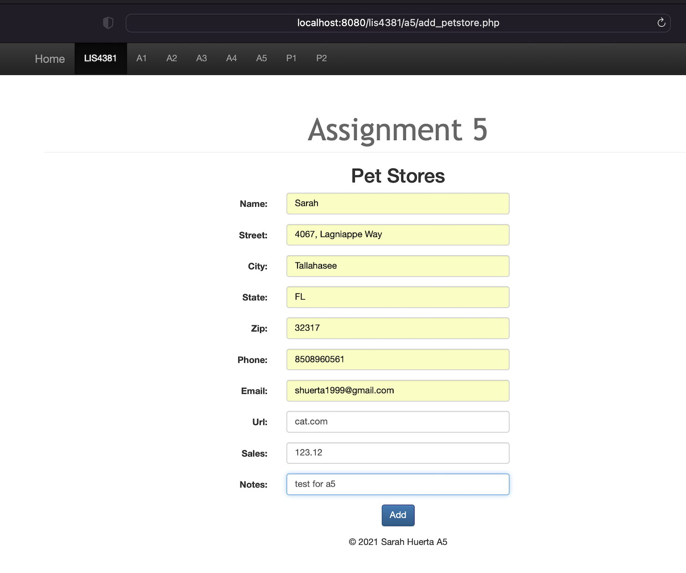 | 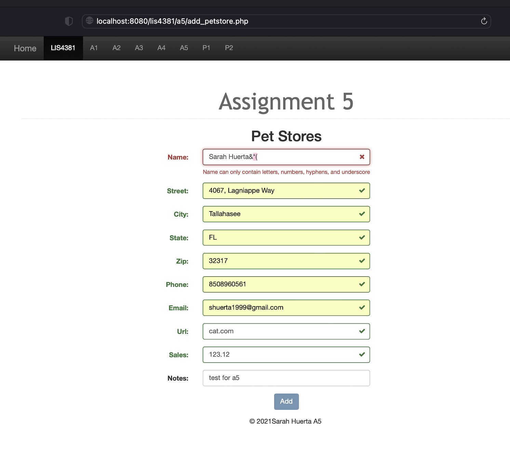 | 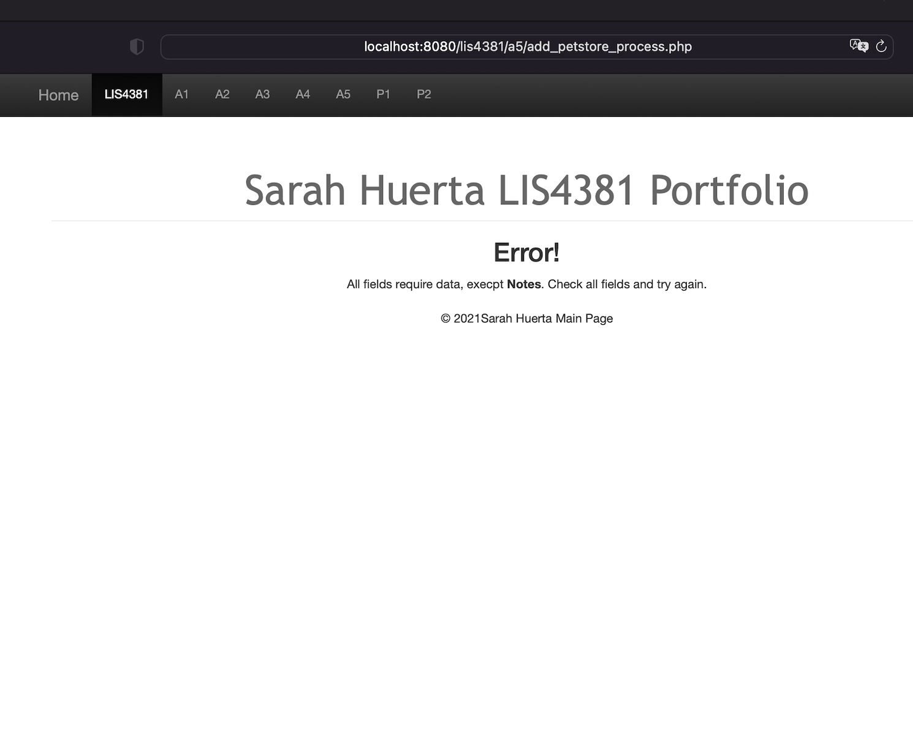 |

| Original Data Inserts |  After Data Insertion |
| -----------------------------------| ----------------------------------- |
| 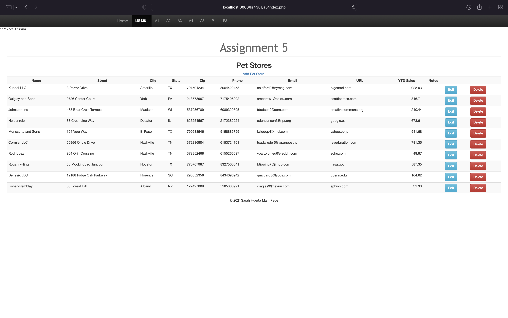 | 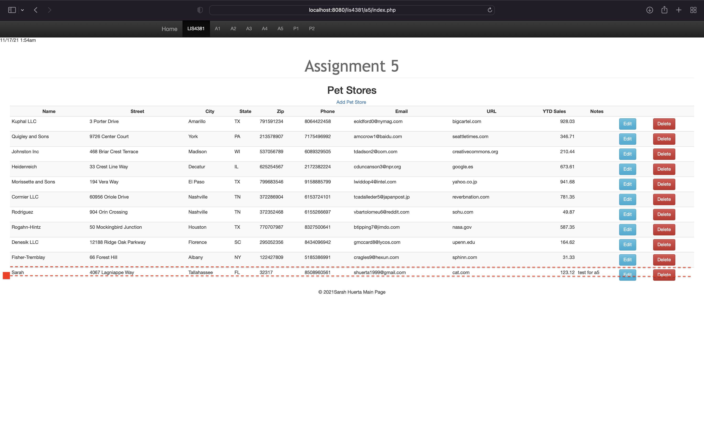 |

| Skill Set 13 |
| -----------------------------------|
| 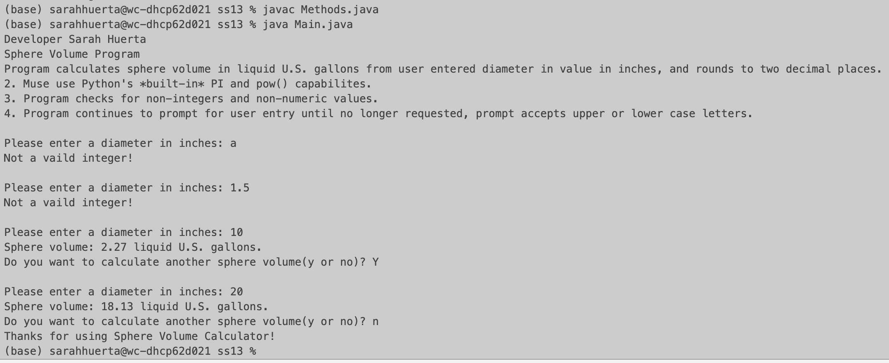 |

| Skill Set 14: calculator | Skill Set 14: Addition
| ----------------- | -------------- |
| 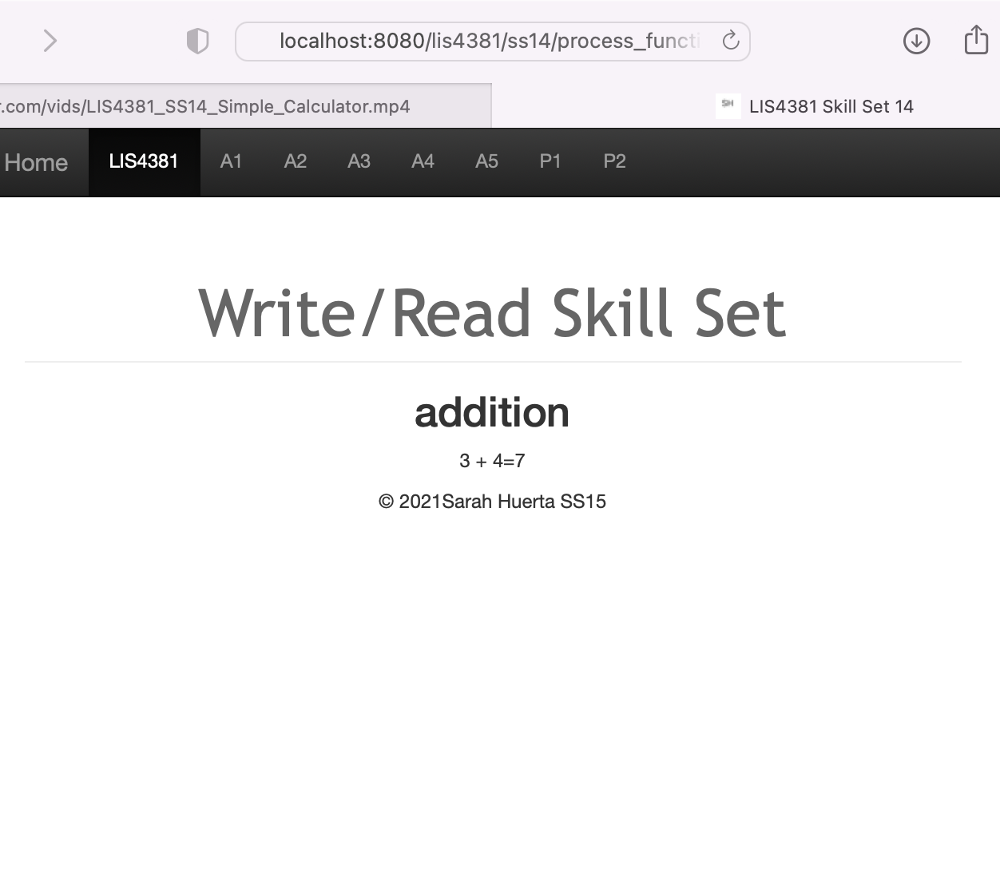 |  |

| Skill Set 14: Divide | Skill Set 14: Divide by Zero Error |
| ----------------- | -------------- |
| 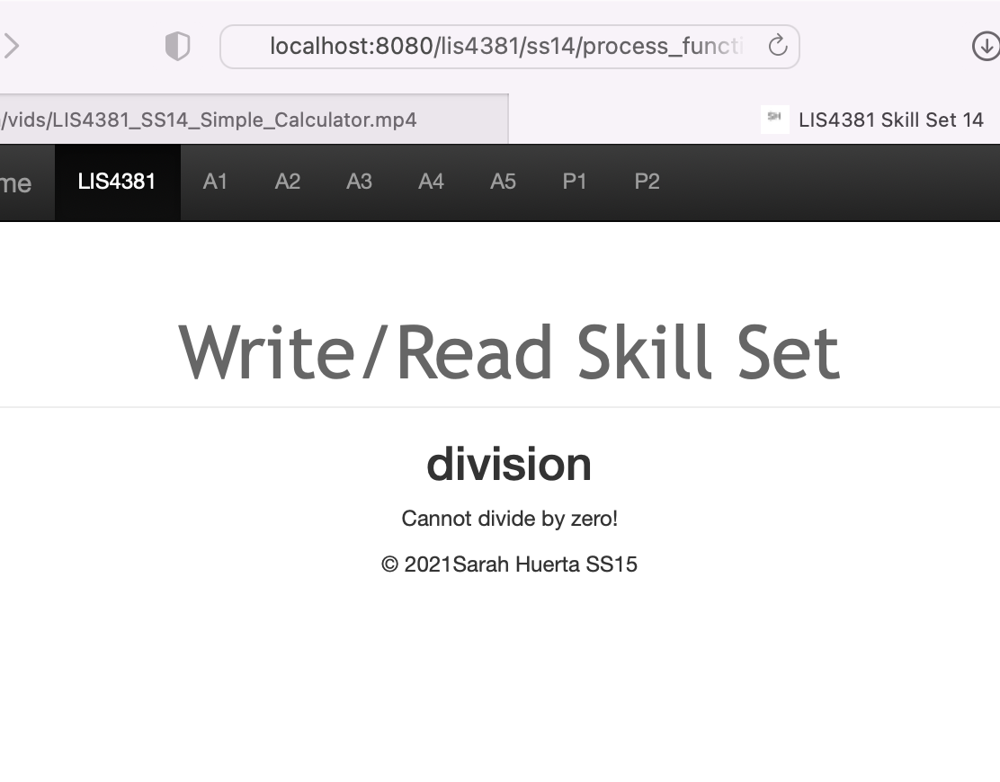 | 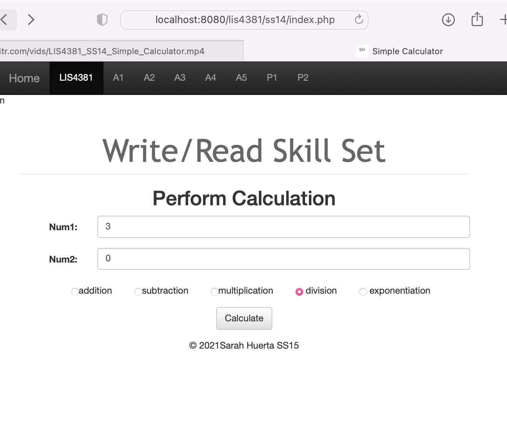 |

| Skill Set 15 Index | Process.php |
| ------------------- | ----------------- |
| 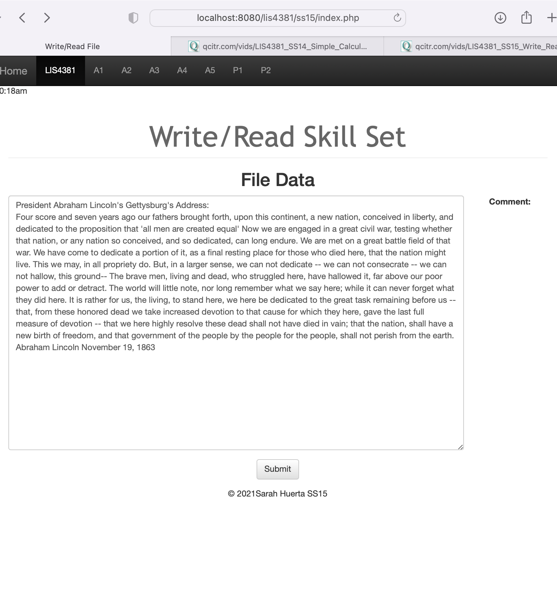 | 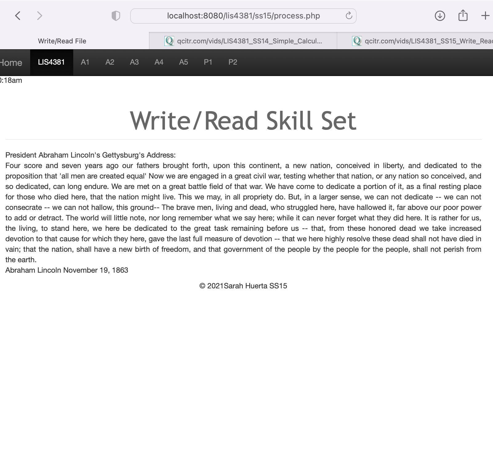 |
