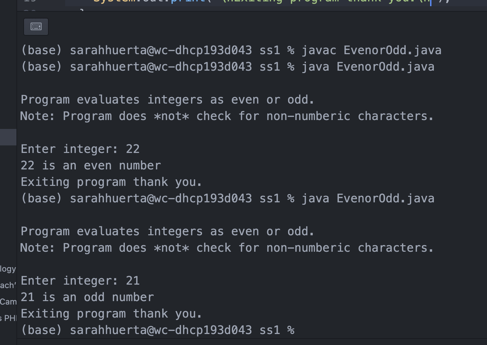
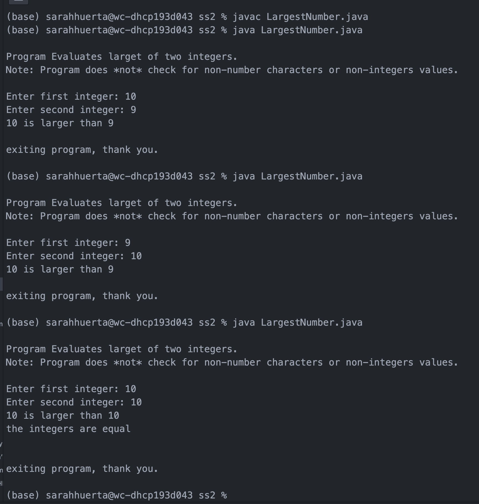
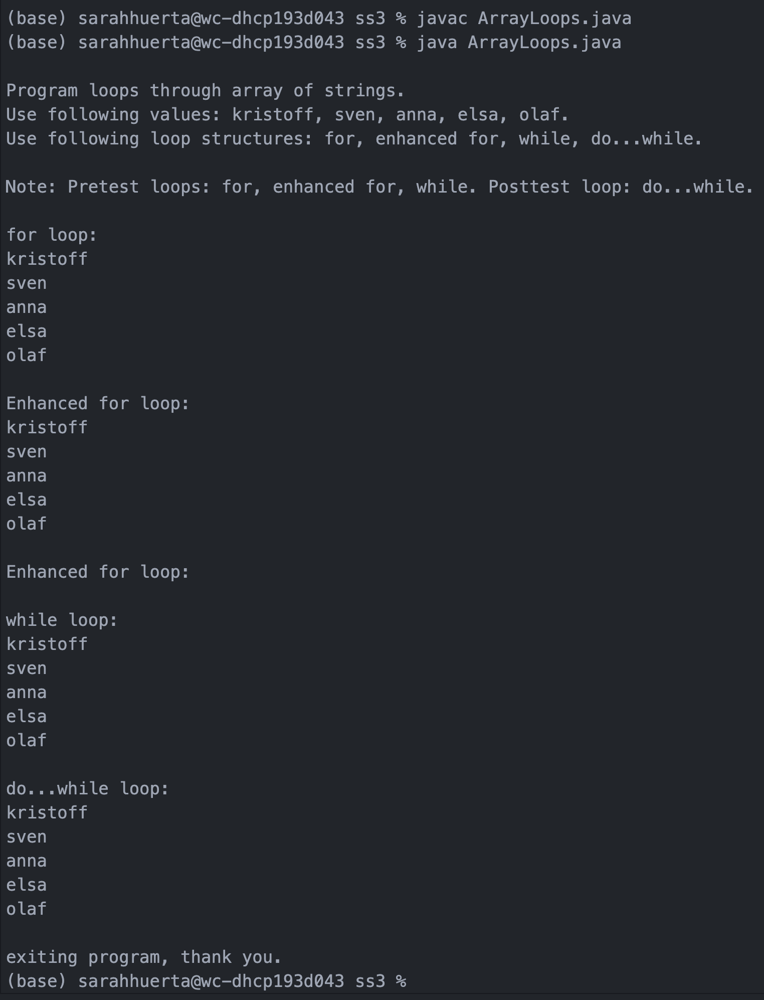
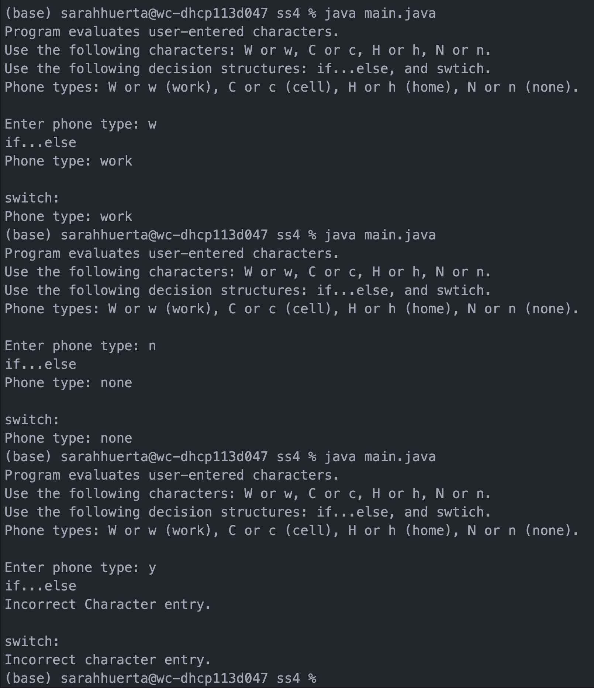
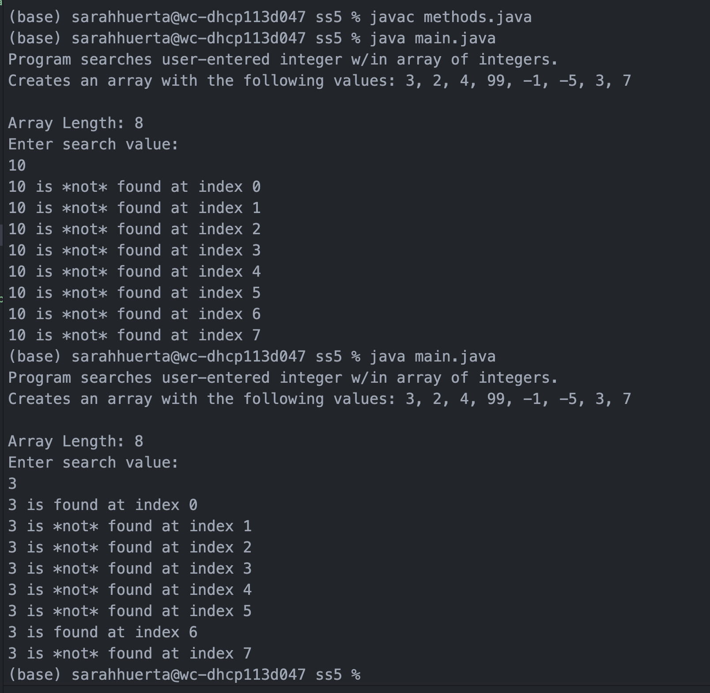
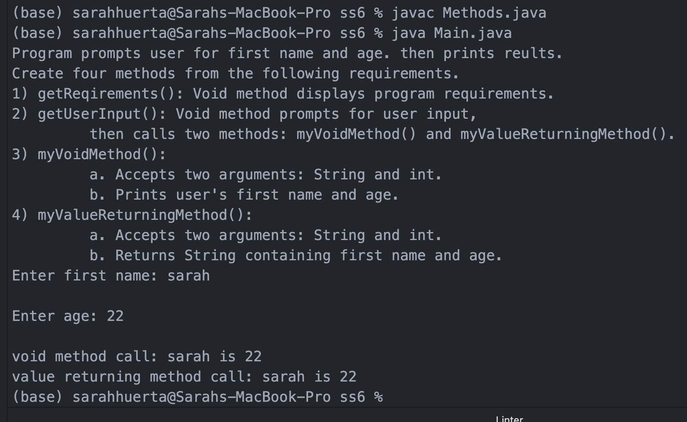

> **NOTE:** This README.md file should be placed at the **root of each of your repos directories.**
>

# LIS4381 - Mobile Web Application Development

## Sarah Huerta

### Skill Set Assignments

#### Skill Set 1: Even or Odd

#### Skill Set Two: Miles Per Gallon

#### Skill Set Three: IT/ICT Student Percentage Calculator

#### Skill Set Four: Decision Structures

#### Skill Set Five: Nested Structure

#### Skill Set Six: Methods

*Future Skill sets to be added soon*
